# WISH

> **소아암 환아를 위한 행동 기반 감정 회복 마을 플랫폼**

WISH는 환아가 가상 마을을 탐험하며 미술, 체조, 태권도, 음악 콘텐츠를 경험하는 웹 기반 인터랙티브 게임 플랫폼입니다.  
환아용 게임 웹, 관리자 웹, 보호자&의료진 웹이 하나의 백엔드와 AI 서비스로 연결되어 활동 수행, 콘텐츠 관리, 환아 활동 모니터링 흐름을 제공합니다.

<br />

## 🔎 목차

<div align="center">


### <a href="#developers"> 👥 팀원 구성</a>
### <a href="#overview">📌 프로젝트 소개</a>
### <a href="#features">✨ 주요 기능</a>
### <a href="#tech-stack">🛠 기술 스택</a>
### <a href="#main-tech">🚀 핵심 기술</a>
### <a href="#architecture">🌐 시스템 아키텍처</a>
### <a href="#erd">🗂 ERD</a>
### <a href="#directories">📂 프로젝트 구조</a>

</div>

---

## 👥 팀원 구성
<a name="developers"></a>

<div align="center">

<div align="center">
<table>
    <tr>
        <td width="33%" align="center"> <a href="https://github.com/JangYoungCheol">
             <br> 장영철 <br>(FE & Leader) </a> <br></td>
        <td width="33%" align="center"> <a href="https://github.com/sehyeon262">
             <br> 김세현 <br>(AI) </a> <br></td>
        <td width="33%" align="center"> <a href="https://github.com/Seorins">
             <br> 박서린 <br>(FE) </a> <br></td>
    </tr>
    <tr>
      <td width="280px" valign="top">
        <sub>
          - 체조 파트 UI 제작 및 ai, 백엔드 api 연결<br>
          - 별빛 에너지 섬 UI 제작 및 보호자 페이지와 연동<br>
          - 발표
        </sub>
      </td>
      <td width="280px" valign="top">
        <sub>
          - 태권도 품새·스트레칭 AI 채점 시스템 및 실시간 피드백 기능 개발<br>
          - Pose 기반 동작 인식·시퀀스 분석 파이프라인 및 AI 모델 학습 구축<br>
          - LSTM · ST-GCN · DTW 기반 동작 분류·실시간 채점 로직 구현<br>
          - 자세 보정·tracking 품질 판정·motion replay·summary 기능 개발<br>
          - FastAPI 기반 AI 분석 서버 및 UI·세션 저장 기능 연동<br>
          - 실제 카메라 데이터 기반 모델 재학습·성능 개선 및 검증<br>
          - RAG 기반 음성 대화(STT/TTS) 기능 및 AI 인터랙션 구현<br>
          - Docker 기반 AI 서버 환경 및 실시간 시스템 연동 구축
        </sub>
      </td>
      <td width="280px" valign="top">
        <sub>
          - Phaser 3 기반 미술·음악 테마 화면 및 콘텐츠 플레이 흐름 구현<br>
          - 자유 그림·색칠하기·작품 앨범 기능 및 MediaPipe 손동작 입력 연동<br>
          - REST·STOMP 기반 캐치마인드 방·라운드·스트로크 실시간 동기화 구현<br>
          - 리듬게임 차트·롱노트·콤보·판정 로직 및 YouTube 음원 연동<br>
          - MediaRecorder 기반 플레이 영상·썸네일 생성 및 S3 결과 저장 연동<br>
          - React·React Query 기반 보호자 페이지 및 활동·감정 데이터 시각화<br>
          - Three.js 기반 3D 동작 리플레이 및 관절 가동 범위 분석 UI 구현<br>
          - AI 주간 리포트 및 SSE·LiveKit 기반 실시간 알림·화면·음성 공유 구현
      </td>
    </tr>

</table>

<table>
    <tr>
        <td width="33%" align="center"> <a href="https://github.com/dain2822">
         <br> 심다인 <br>(FE) </a> <br></td>
        <td width="33%" align="center"> <a href="https://github.com/gunbread0418">
         <br> 임건빈 <br>(BE & Infra) </a> <br></td>
        <td width="33%" align="center"> <a href="https://github.com/hjh1248">
         <br> 하정호 <br>(BE) </a> <br></td>
    </tr>
    <tr>
        <td width="280px" valign="top"> 
          <sub>
         - 태권도 품새 콘텐츠 전반 UI 및 게임 플레이 흐름 설계·구현<br>
         - 품새 목록·동작·세션 저장 API 및 태권도 AI 판정 연동<br>
         - 마을 및 테마 씬 포털 이동과 진입 불가 구역 로직 구현
          </sub>
        </td>
        <td width="280px" valign="top">
          <sub>
          - 자체 도메인 기반 DNS 및 서비스별 하위 도메인 라우팅 구성<br>
          - nginx 기반 프론트엔드, 백엔드 API, AI 서버 접근 경로 분리<br>
          - Docker / Docker Compose 기반 백엔드·프론트엔드·AI 서버 개발 배포 환경 구성<br>
          - GitLab CI/CD와 Jenkins를 활용한 자동 빌드·배포 파이프라인 구축<br>
          - Prometheus / Grafana 기반 백엔드, PostgreSQL, Redis, EC2 모니터링 대시보드 구축<br>
          - SSE, FCM, LiveKit 기반 실시간 알림·접속 상태·보호자 모니터링 API 구현<br>
          - 운동 좌표 데이터 저장/조회 API, 보호자 움직임 분석, 3D 리플레이 아바타 보정 기능 개발<br>
          - AI 분석 서버와 백엔드 연동 및 분석 결과 실시간 이벤트 처리 
          </sub>
        </td>
        <td width="280px" valign="top">
          <sub>
          - 마을 광장 실시간 멀티플레이 — WebSocket/STOMP 인프라 설계부터 위치 동기화, 이모티콘 소통, 자동 재접속까지 전체 구현<br>
          - NPC 대화 시스템 — Claude LLM 연동 + 대화 카탈로그 설계, 보호자용 대화 요약 API<br>
          - 마을 미니게임 백엔드 — 오목(온라인 대전/랭킹/채팅/관전), 태권도(동작 저장/띠 승급), 체조 세션 API<br>
          - 보호자·관리자 대시보드 — 활동 통계, 사용 시간 순위, 시간대 히트맵, 권한 관리
          </sub>
        </td>
    </tr>

</table>
</div>
<br>

</div>

---

## 📌 프로젝트 소개

<a name="overview"></a>

WISH는 장기 입원 중인 소아암 환아들이 병실 안에서도 신체 활동과 감정 표현을 자연스럽게 경험할 수 있도록 설계된 AI 기반 디지털 일상회복 플랫폼입니다.

사용자는 게임 형태의 콘텐츠를 통해 다양한 활동에 참여하며, 병실 환경에서도 즐겁게 몸을 움직이고 자신의 감정을 표현할 수 있습니다.

서비스는 다음 목표에 집중합니다.

- 게임 기반 인터랙션을 통한 자연스러운 참여 경험 제공
- AI 자세·동작 인식을 활용한 실시간 운동 분석 및 피드백 제공
- 병실 환경에서도 가능한 비접촉형 신체 활동 콘텐츠 제공
- 활동 기록 및 결과 데이터를 통한 환아 경험 관리
- 보호자·의료진이 환아의 활동 과정과 변화를 확인할 수 있는 관리 기능 제공

---

## ✨ 주요 기능

<a name="features"></a>

### 🧩 서비스 구성

| 웹 | 대상 | 역할 |
| --- | --- | --- |
| **환아용 게임 웹** | 환아 | 마을 탐험, 미술 활동, 체조/태권도 활동, 실시간 피드백 |
| **관리자 웹** | 운영자 / 관리자 | 운동 콘텐츠, 썸네일, 시범 영상, 서비스 운영 데이터 관리 |
| **보호자&의료진 웹** | 보호자 / 의료진 | 환아 프로필, 작품, 운동 세션, 피드백 기록 확인 |

<br />

### 🎮 환아용 게임 웹

| 기능 | 설명 |
| --- | --- |
| **마을 탐험** | Phaser 기반 2D 마을에서 캐릭터를 조작하고 테마 포털로 이동합니다. |
| **미술 활동** | 자유 그리기와 색칠하기 콘텐츠를 제공하며 손 추적 기반 조작을 지원합니다. |
| **작품 앨범** | 저장한 작품을 목록/상세로 조회하고 수정 또는 삭제할 수 있습니다. |
| **체조 콘텐츠** | 카메라로 자세를 인식해 제자리 걷기, 사이드 스텝, 대각선 지르기 등 체조 동작을 수행합니다. |
| **태권도 콘텐츠** | 자세 정규화, 방향 분류, 품새 선택 등 태권도 활동 흐름을 제공합니다. |
| **음악 콘텐츠** | 음악 공간에서 곡을 선택하고 리듬 게임을 플레이하며 점수와 콤보 결과를 확인합니다. |
| **감정 대화 / 별빛 에너지** | NPC와 감정을 나누고 보호자가 보낸 별빛 에너지를 게임 안에서 확인합니다. |
| **데모 인증** | MVP 환경에서 로그인 없이 데모 토큰을 발급받아 게임을 실행할 수 있습니다. |

**주요 화면**

<p align="center">
  
  <br />
  <sub><b>마을 탐험</b></sub>
</p>

<table>
  <tr>
    <td align="center" width="33%">
      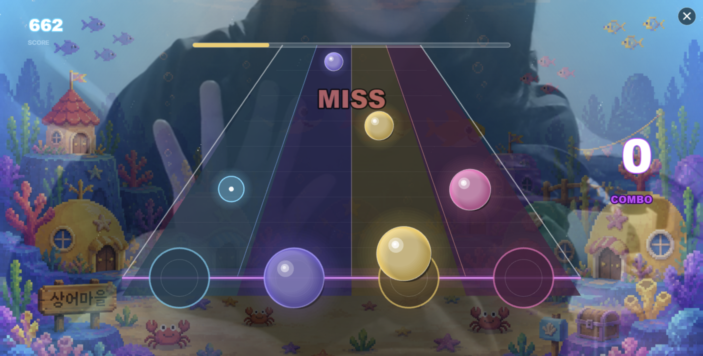
      <br />
      <sub><b>리듬 게임</b></sub>
    </td>
    <td align="center" width="33%">
      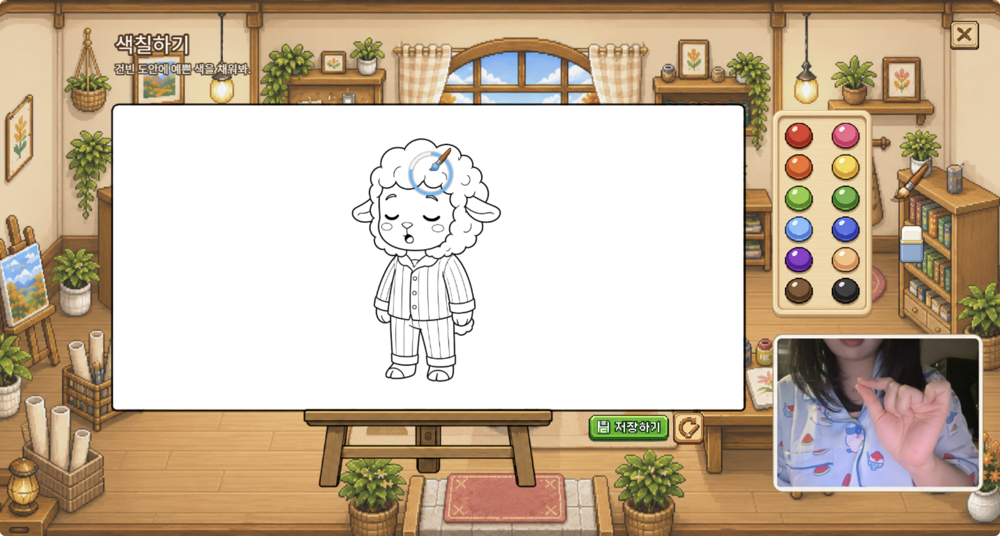
      <br />
      <sub><b>색칠하기</b></sub>
    </td>
    <td align="center" width="33%">
      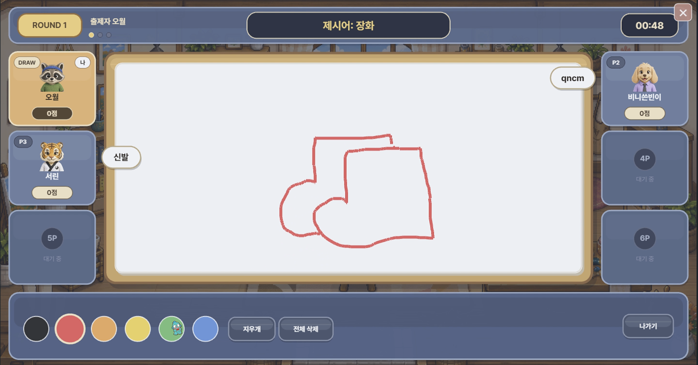
      <br />
      <sub><b>멀티 그림 퀴즈</b></sub>
    </td>
  </tr>
  <tr>
    <td align="center" width="33%">
      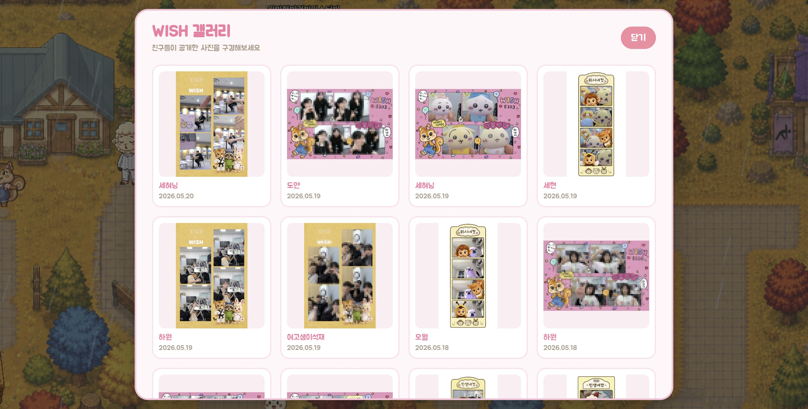
      <br />
      <sub><b>위시네컷</b></sub>
    </td>
    <td align="center" width="33%">
      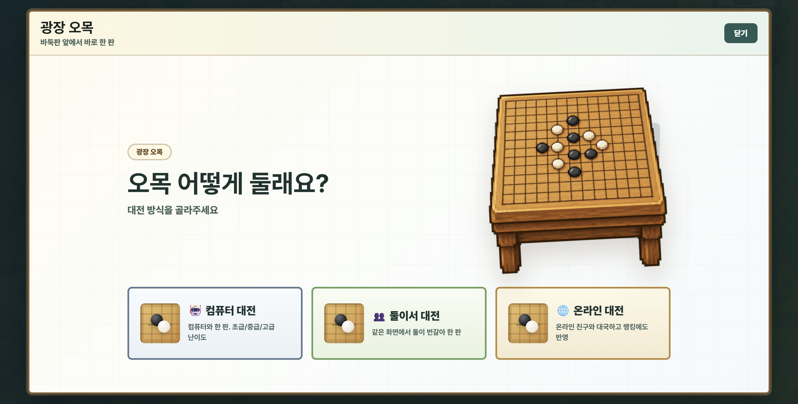
      <br />
      <sub><b>오목 게임</b></sub>
    </td>
    <td align="center" width="33%">
      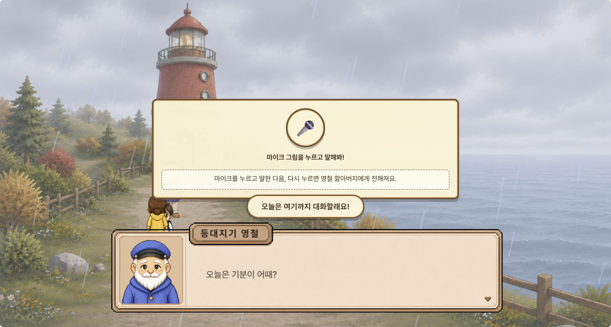
      <br />
      <sub><b>등대지기 대화</b></sub>
    </td>
  </tr>
  <tr>
    <td align="center" width="33%">
      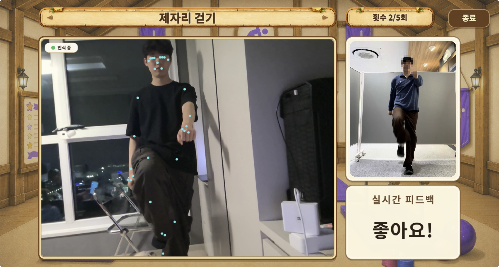
      <br />
      <sub><b>체조 콘텐츠</b></sub>
    </td>
    <td align="center" width="33%">
      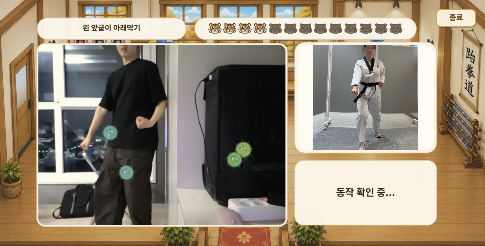
      <br />
      <sub><b>태권도 콘텐츠</b></sub>
    </td>
    <td align="center" width="33%">
      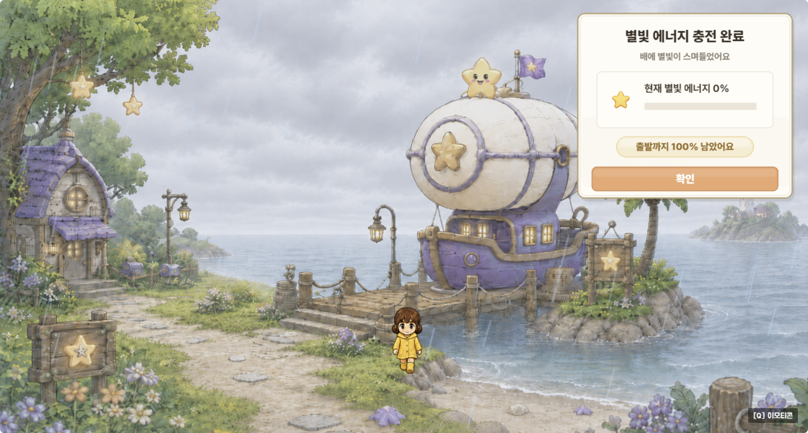
      <br />
      <sub><b>별빛 에너지</b></sub>
    </td>
  </tr>
</table>

<br />

### 🧑‍💼 관리자 웹

| 기능 | 설명 |
| --- | --- |
| **관리자 로그인/회원가입** | JWT 기반 인증을 통해 관리자 기능에 접근합니다. |
| **운영 대시보드** | 전체 보호자, 환아 프로필, 활성 환아, 이탈 위험 등 서비스 운영 지표를 확인합니다. |
| **유저 관리** | 사용자 계정, 환아 프로필 등록 여부, 권한 정보를 조회하고 관리합니다. |
| **체조 동작 목록 조회** | 체조 타입별 동작을 루틴 순서대로 확인합니다. |
| **체조 동작 등록/수정/삭제** | 동작명, 설명, 목표 횟수, 썸네일, 시범 영상을 관리합니다. |
| **태권도 동작 관리** | 품새별 동작 순서, 목표 횟수, 썸네일, 시범 영상을 관리합니다. |
| **미디어 업로드** | multipart 요청으로 썸네일 이미지와 데모 영상을 함께 업로드합니다. |

**주요 화면**

<p align="center">
  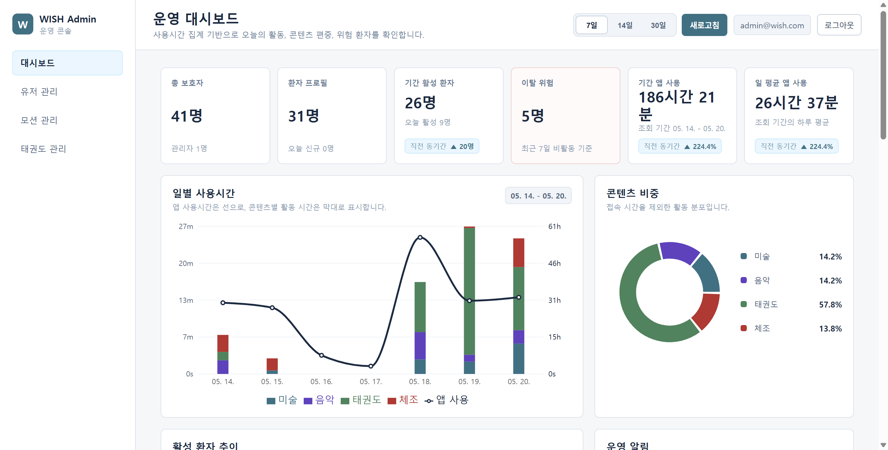
  <br />
  <sub><b>운영 대시보드</b></sub>
</p>

<table>
  <tr>
    <td align="center" width="33%">
      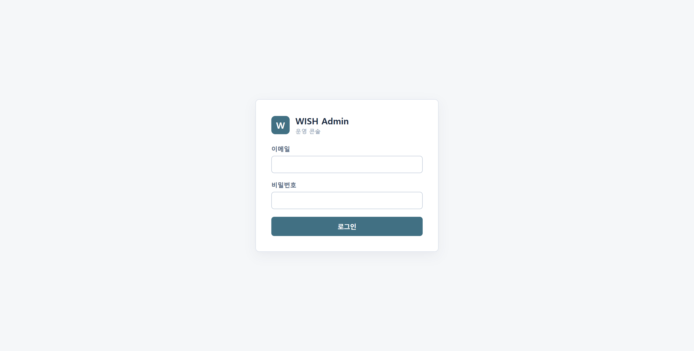
      <br />
      <sub><b>운영자 로그인</b></sub>
    </td>
    <td align="center" width="33%">
      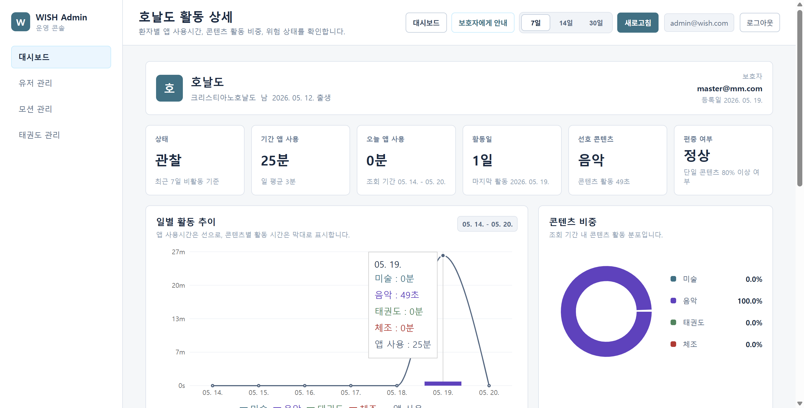
      <br />
      <sub><b>유저 관리</b></sub>
    </td>
    <td align="center" width="33%">
      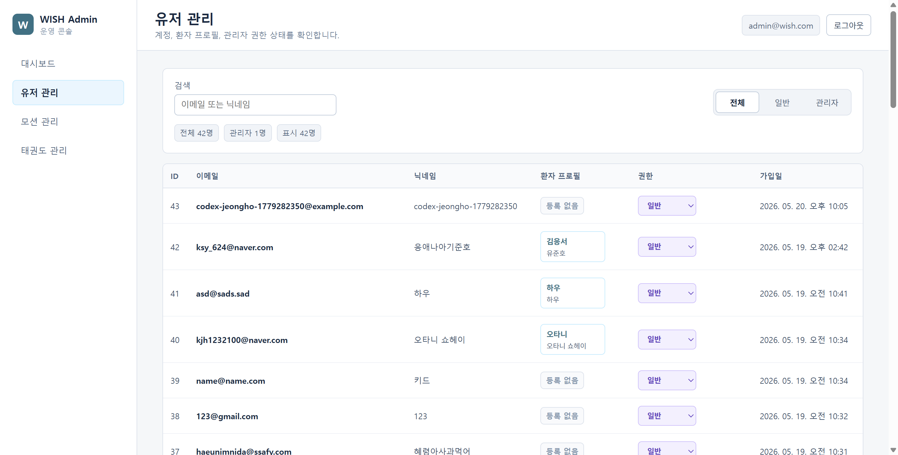
      <br />
      <sub><b>체조 모션 관리</b></sub>
    </td>
  </tr>
  <tr>
    <td align="center" width="33%">
      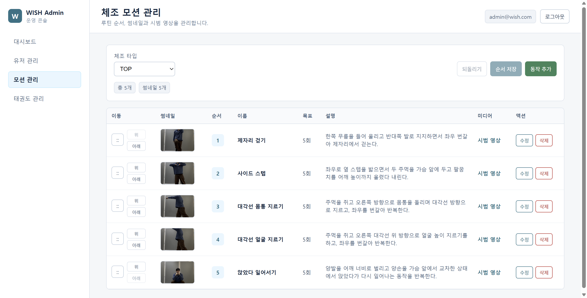
      <br />
      <sub><b>태권도 동작 관리</b></sub>
    </td>
    <td align="center" width="33%">
      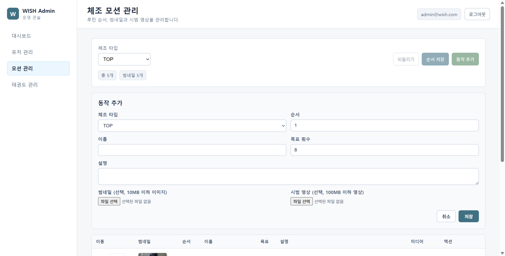
      <br />
      <sub><b>체조 동작 추가</b></sub>
    </td>
    <td align="center" width="33%">
      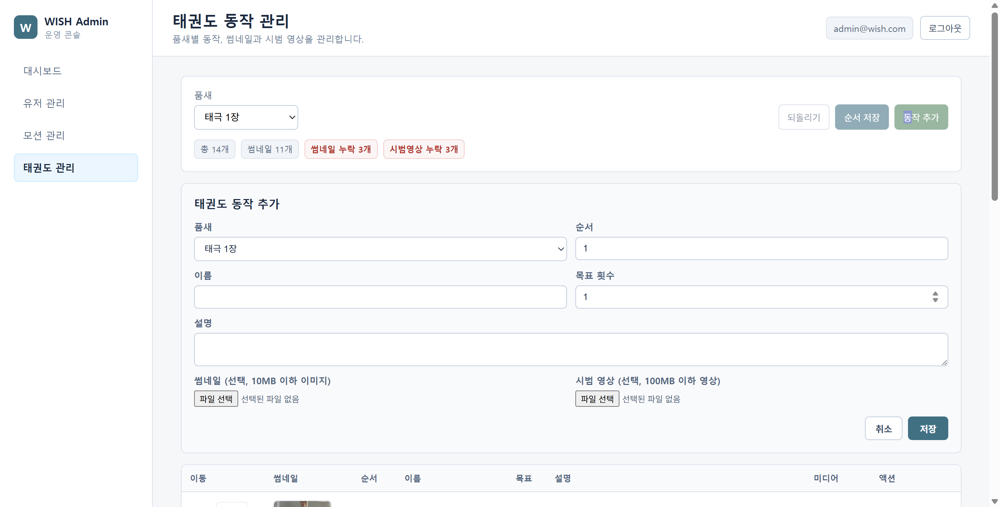
      <br />
      <sub><b>태권도 동작 추가</b></sub>
    </td>
  </tr>
</table>

<br />

### 👨‍👩‍👧 보호자&의료진 웹

| 기능 | 설명 |
| --- | --- |
| **환아 프로필 관리** | 보호자 계정 하위의 환아 정보를 등록하고 조회합니다. |
| **활동 기록 확인** | 환아가 수행한 미술 활동과 운동 세션 이력을 확인합니다. |
| **작품 조회** | 환아가 저장한 색칠하기/그리기 작품과 공개 여부를 확인합니다. |
| **운동 결과 모니터링** | 체조 세션별 수행 시간, 평균 정확도, 완료 동작 수를 확인합니다. |
| **피드백 확인** | 동작별 정확도와 대표 피드백을 바탕으로 환아의 수행 상태를 파악합니다. |
| **주간 리포트** | 사용 시간, 활동 성취, 가동 범위 추이, AI 인사이트를 요약해 확인합니다. |
| **실시간 모니터링** | 환아의 접속 상태와 게임 화면을 실시간으로 확인하고 알림을 받을 수 있습니다. |
| **별빛 에너지 응원** | 보호자가 응원 메시지와 에너지를 보내 환아의 활동 여정을 지원합니다. |

**주요 화면**

<p align="center">
  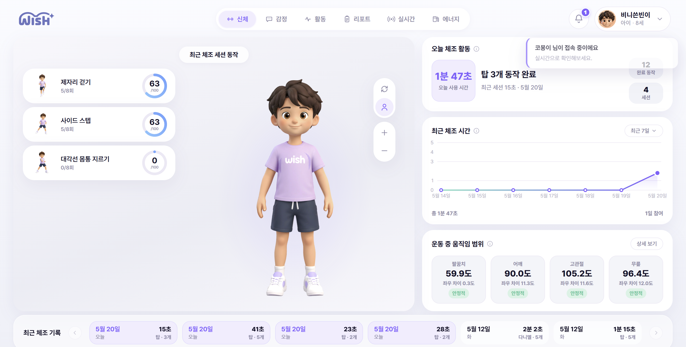
  <br />
  <sub><b>운동 결과 모니터링</b></sub>
</p>

<table>
  <tr>
    <td align="center" width="33%">
      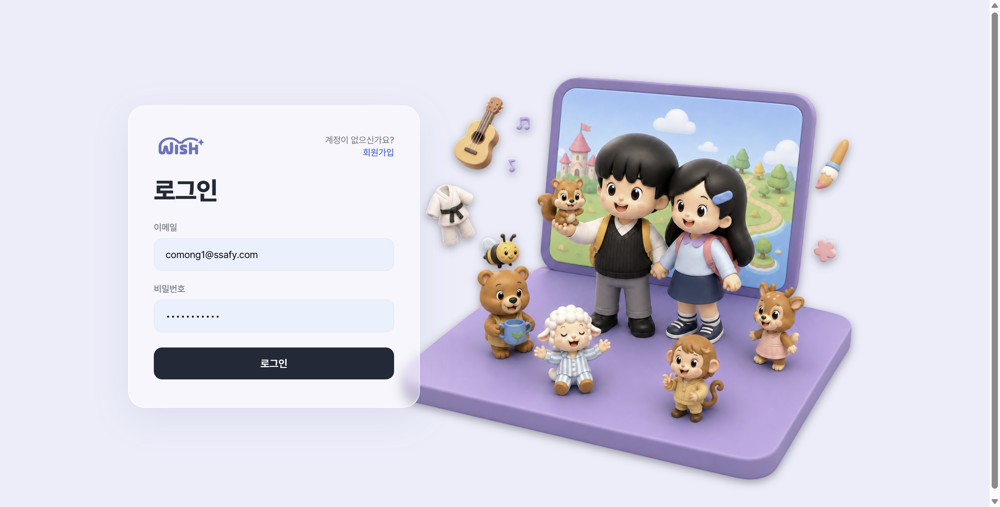
      <br />
      <sub><b>보호자 로그인</b></sub>
    </td>
    <td align="center" width="33%">
      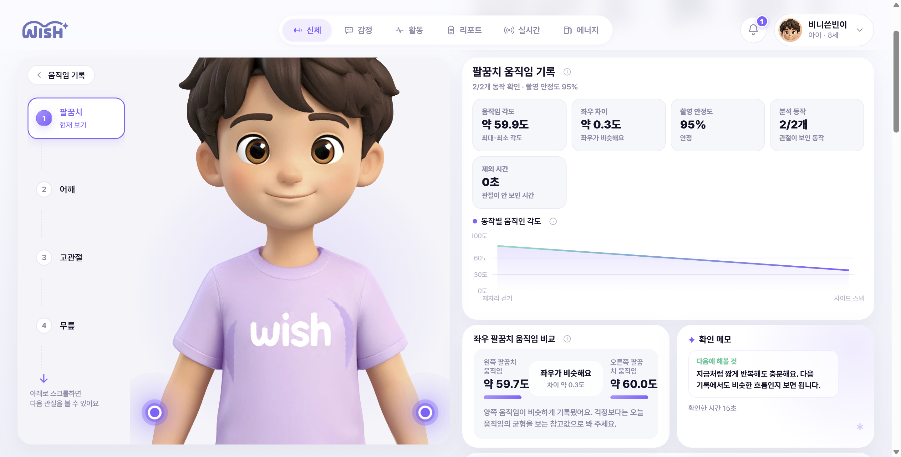
      <br />
      <sub><b>신체 대시보드</b></sub>
    </td>
    <td align="center" width="33%">
      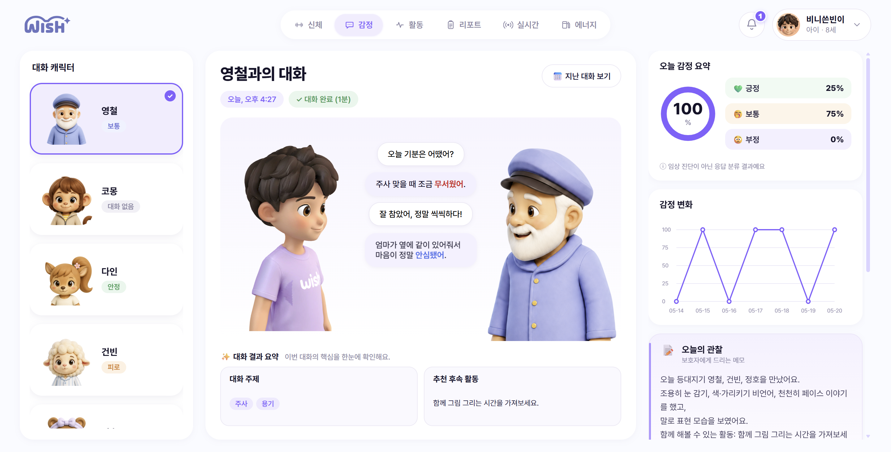
      <br />
      <sub><b>감정 대화 확인</b></sub>
    </td>
  </tr>
  <tr>
    <td align="center" width="33%">
      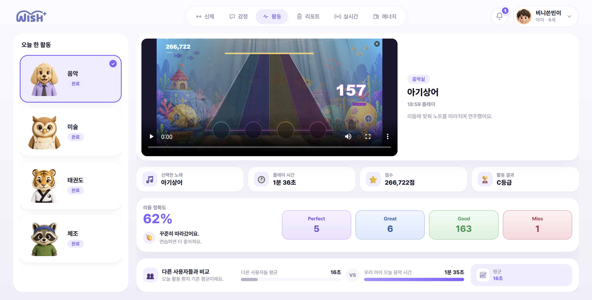
      <br />
      <sub><b>음악 활동 확인</b></sub>
    </td>
    <td align="center" width="33%">
      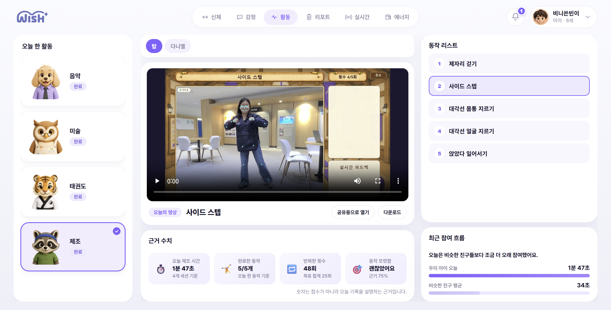
      <br />
      <sub><b>체조 활동 확인</b></sub>
    </td>
    <td align="center" width="33%">
      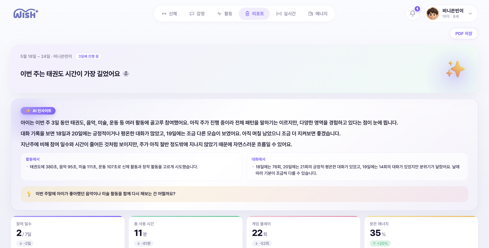
      <br />
      <sub><b>AI 리포트</b></sub>
    </td>
  </tr>
  <tr>
    <td align="center" width="33%">
      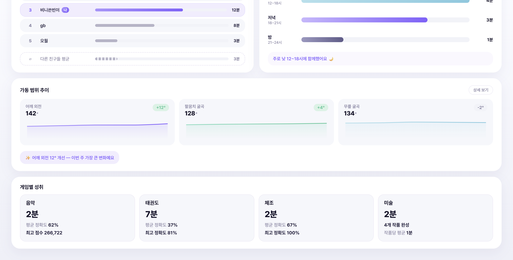
      <br />
      <sub><b>리포트 상세</b></sub>
    </td>
    <td align="center" width="33%">
      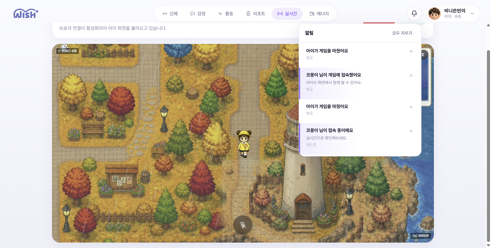
      <br />
      <sub><b>실시간 모니터링</b></sub>
    </td>
    <td align="center" width="33%">
      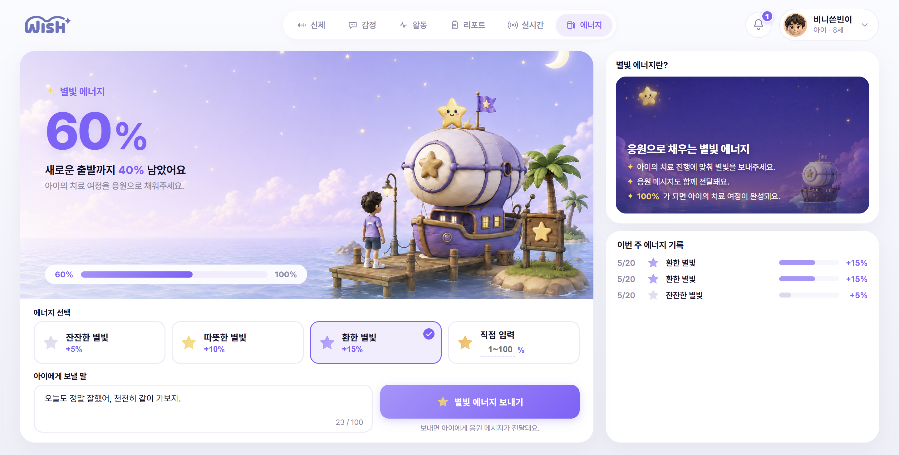
      <br />
      <sub><b>별빛 에너지</b></sub>
    </td>
  </tr>
</table>

<br />

### 🤖 AI 서비스

| 영역 | 설명 |
| --- | --- |
| **Pose Normalization** | 카메라에서 전달된 Pose Landmark를 운동 평가에 적합한 좌표계로 정규화합니다. |
| **Gymnastics Evaluation** | 제자리 걷기, 사이드 스텝, 대각선 몸통 지르기, 대각선 얼굴 지르기 동작을 평가합니다. |
| **Taekwondo Classification** | 태권도 기본 동작, 자세, 방향 전환을 분류합니다. |
| **Tracking Quality** | 랜드마크 누락, 평균 신뢰도, 추적 품질 점수를 계산합니다. |
| **Feedback Stabilization** | 프레임 단위 피드백이 흔들리지 않도록 대표 피드백과 상태를 관리합니다. |

---

## 🛠 기술 스택

<a name="tech-stack"></a>

### Frontend

<div align="center">


</div>

| 기술 | 용도 |
| --- | --- |
| **React 19** | 환아용 게임 웹, 관리자 웹, 보호자&의료진 웹 Shell 구성 |
| **TypeScript** | 프론트엔드 타입 안정성 |
| **Vite** | 앱 개발 서버 및 번들링 |
| **Phaser 3** | 2D 게임 월드, 씬, 캐릭터, 인터랙션 구현 |
| **MediaPipe Tasks Vision** | 손/자세 랜드마크 기반 사용자 동작 인식 |
| **TanStack Query** | 서버 상태 관리 |
| **Zustand** | 클라이언트 전역 상태 관리 |
| **React Hook Form + Zod** | 관리자 폼 처리 및 검증 |
| **Turborepo + pnpm workspace** | 모노레포 빌드 파이프라인 |

<br />

### Backend

<div align="center">


</div>

| 기술 | 용도 |
| --- | --- |
| **Spring Boot 4.0.5** | REST API 서버 |
| **Java 21** | 백엔드 개발 언어 |
| **Spring Security + JWT** | 인증/인가 |
| **Spring Data JPA** | ORM 기반 데이터 접근 |
| **PostgreSQL 15** | 서비스 데이터 저장 |
| **Flyway** | DB 마이그레이션 |
| **Springdoc OpenAPI** | Swagger API 문서 |
| **Testcontainers** | PostgreSQL 기반 통합 테스트 |
| **Spotless + Google Java Format** | 코드 포매팅 |

<br />

### AI

<div align="center">


</div>

| 기술 | 용도 |
| --- | --- |
| **FastAPI** | AI 평가 API 서버 |
| **Pydantic** | 요청/응답 스키마 검증 |
| **Uvicorn** | ASGI 서버 |
| **Pytest** | 동작 평가 로직 테스트 |

<br />

### Infra & DevOps

<div align="center">


</div>

| 기술 | 용도 |
| --- | --- |
| **Docker / Docker Compose** | 로컬/개발/플랫폼 환경 구성 |
| **Nginx** | 프론트/백엔드 라우팅 |
| **GitLab CI** | verify → build → package → deploy 파이프라인 |
| **Jenkins** | 개발 서버 배포 Job 트리거 |
| **Prometheus / Grafana** | 서비스 및 인프라 모니터링 |

---

## 🚀 핵심 기술

<a name="main-tech"></a>

<details>
<summary><b>Phaser 기반 마을형 게임 구조</b></summary>

<br />

게임 앱은 `StartScene`에서 시작해 `VillageScene`을 중심 허브로 사용합니다.  
마을 안의 포털을 통해 미술, 체조, 태권도, 음악 테마 씬으로 이동하는 구조입니다.

```text
StartScene
   │
   ▼
VillageScene
   ├── ArtSelectScene
   │   ├── ArtFreeDrawingScene
   │   ├── ArtColoringSelectScene
   │   ├── ArtColoringScene
   │   └── ArtAlbumScene
   ├── GymnasticsSelectScene
   │   ├── GymnasticsTopScene
   │   └── GymnasticsDanielScene
   ├── TaekwondoSelectScene
   │   └── TaekwondoPoomsaeSelectScene
   └── MusicSelectScene
```

- 씬 전환은 Phaser Scene 시스템으로 관리합니다.
- 캐릭터 이동, 카메라 Follow, 포털 진입 판정, 대화 UI가 분리되어 있습니다.
- 이미지/사운드 리소스는 `frontend/apps/game/public/assets` 하위에 테마별로 관리합니다.

</details>

<details>
<summary><b>MediaPipe 기반 손/자세 추적</b></summary>

<br />

프론트엔드는 MediaPipe Tasks Vision을 사용해 카메라 프레임에서 손과 자세 랜드마크를 추출합니다.  
추출된 좌표는 게임 내 커서 조작, 색칠/그리기, 운동 동작 평가에 활용됩니다.

```text
Camera Frame
   │
   ├── Hand Landmark → 그림 도구 선택 / 색상 선택 / 캔버스 조작
   │
   └── Pose Landmark → AI 서버 자세 정규화 / 동작 평가 / 피드백 생성
```

- 손 추적: 브러시, 지우개, 색상, 저장/초기화 버튼 조작
- 자세 추적: 체조 및 태권도 동작 평가용 랜드마크 전달
- 프레임별 좌표 흔들림을 줄이기 위한 smoothing, confidence, reference 계산 로직 포함

</details>

<details>
<summary><b>AI 동작 평가 파이프라인</b></summary>

<br />

AI 서비스는 FastAPI로 분리되어 있으며, 프론트엔드에서 전달한 랜드마크를 정규화한 뒤 동작별 평가 결과를 반환합니다.

```text
Pose Landmark
   │
   ▼
Normalize
   │
   ├── Gymnastics Evaluator
   │   ├── March
   │   ├── Side Step
   │   ├── Diagonal Body Punch
   │   └── Diagonal Face Punch
   │
   └── Taekwondo Classifier
       ├── Calibration
       ├── Basic Motion
       ├── Stance
       └── Direction
```

평가 결과에는 다음 정보가 포함됩니다.

- 동작 상태(`idle`, 진행 중, 완료 등)
- 반복 횟수 및 목표 횟수
- 정확도 점수
- 실시간 피드백
- 추적 품질
- 대표 피드백 및 프레임 안정화 상태

</details>

<details>
<summary><b>학습/튜닝 기반 동작 인식 기준</b></summary>

<br />

환아가 카메라 앞에서 수행하는 동작을 안정적으로 판단하기 위해, 동작별 특징값과 판정 기준을 설계하고 반복 테스트를 통해 보정했습니다.  
현재 레포 기준으로는 별도 모델 파일을 로드하는 방식이 아니라, MediaPipe Pose Landmark에서 추출한 특징값을 기반으로 동작 상태, 정확도, 피드백을 계산하는 구조입니다.

```text
Pose Landmark
   │
   ▼
Feature Extraction
   ├── 관절 각도
   ├── 손목 / 무릎 / 발목 위치
   ├── 골반 중심 이동량
   ├── 몸통 기울기
   └── 기준 자세 대비 변화량
   │
   ▼
Motion Scoring
   ├── 동작 상태 분류
   ├── 반복 횟수 카운팅
   ├── 정확도 계산
   └── 피드백 후보 선정
   │
   ▼
Feedback Stabilization
   ├── 프레임 단위 흔들림 완화
   ├── 대표 피드백 누적
   └── 보호자&의료진 기록용 결과 저장
```

| 구분 | 학습/튜닝한 기준 | 활용 |
| --- | --- | --- |
| **제자리 걷기** | 허벅지 각도, 좌우 우세 다리, 골반 이동량, 몸통 기울기 | 반복 횟수, 정확도, “다리를 더 높게 들어요” 등 피드백 |
| **사이드 스텝** | 좌우 발 이동 폭, 발목 간 거리, 골반 깊이 이동, 몸통 기울기 | 좌우 스텝 판정, 제자리 이탈 감지 |
| **대각선 몸통 지르기** | 손목 전방 이동량, 팔꿈치 각도, 보폭, 반대팔 접힘 | 지르기 동작 인식, 팔 펴기/보폭 피드백 |
| **대각선 얼굴 지르기** | 손목 높이, 손목 전방 이동량, 팔꿈치 각도, 보폭 | 얼굴 높이 지르기 판정, 주먹 높이 피드백 |
| **태권도 기본 동작** | 손목 위치, 중심선 거리, 팔꿈치 각도, 반대 손 위치 | 준비 자세, 아래막기, 몸통 지르기 분류 |
| **태권도 자세/방향** | 발 간격, 무릎 각도, 어깨·골반·발목 좌표 변화 | 준비/걷기/앞굽이 자세와 방향 전환 분류 |

동작 판정은 단일 프레임만 보지 않고, 이전 상태와 누적 상태를 함께 사용합니다.  
이를 통해 같은 동작이 중복 카운트되는 문제를 줄이고, 피드백이 화면에서 빠르게 흔들리지 않도록 안정화했습니다.

</details>

<details>
<summary><b>작품 저장 및 앨범 관리</b></summary>

<br />

미술 콘텐츠에서 생성한 결과물은 이미지 파일과 메타데이터를 함께 백엔드로 전송합니다.

```text
Canvas Result
   │
   ├── image Blob
   └── metadata
       ├── sketchCode
       ├── playDurationSeconds
       └── isPublic
   │
   ▼
Multipart Upload
   │
   ▼
Spring API
   ├── LocalImageStorage
   └── PostgreSQL artworks
```

- 내 작품 목록은 최신순 페이지네이션으로 조회합니다.
- 공개 작품은 비로그인 사용자도 조회할 수 있는 갤러리 API로 분리했습니다.
- 비공개 작품은 작성자만 조회/수정/삭제할 수 있도록 권한을 검사합니다.

</details>

<details>
<summary><b>운동 콘텐츠 관리와 세션 기록</b></summary>

<br />

운동 콘텐츠는 관리자 웹에서 마스터 데이터를 관리하고, 환아가 수행한 결과는 세션 단위로 저장합니다. 저장된 결과는 보호자&의료진 웹에서 활동 기록과 피드백 확인에 활용됩니다.

| 데이터 | 설명 |
| --- | --- |
| **Exercise Motion** | 운동 타입, 동작명, 루틴 순서, 목표 횟수, 설명, 썸네일, 시범 영상 |
| **Exercise Session** | 환아별 운동 세션, 전체 수행 시간, 평균 정확도, 완료 동작 수 |
| **Exercise Session Motion** | 세션 내 동작별 수행 시간, 정확도, 완료 횟수, 피드백 |

기본 TOP 체조 루틴은 Flyway seed migration으로 관리합니다.

- 제자리 걷기
- 사이드 스텝
- 대각선 몸통 지르기
- 대각선 얼굴 지르기
- 앉았다 일어서기

</details>

---

## 🌐 시스템 아키텍처

<a name="architecture"></a>

<p align="center">
  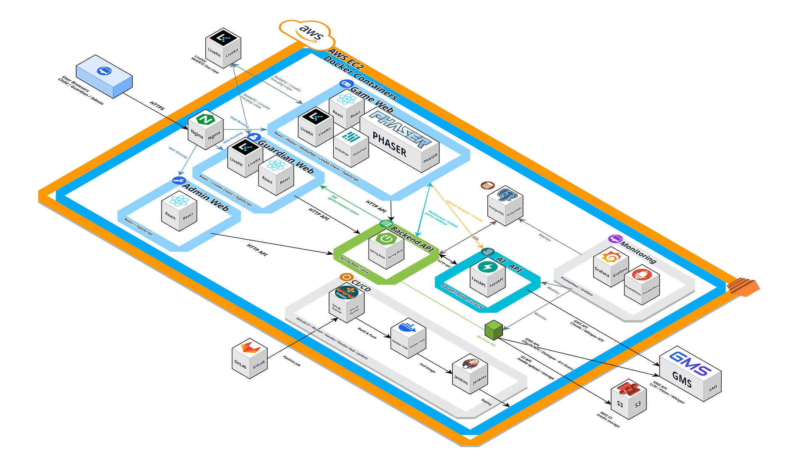
</p>

---

## 🗂 ERD

<a name="erd"></a>

<p align="center">
  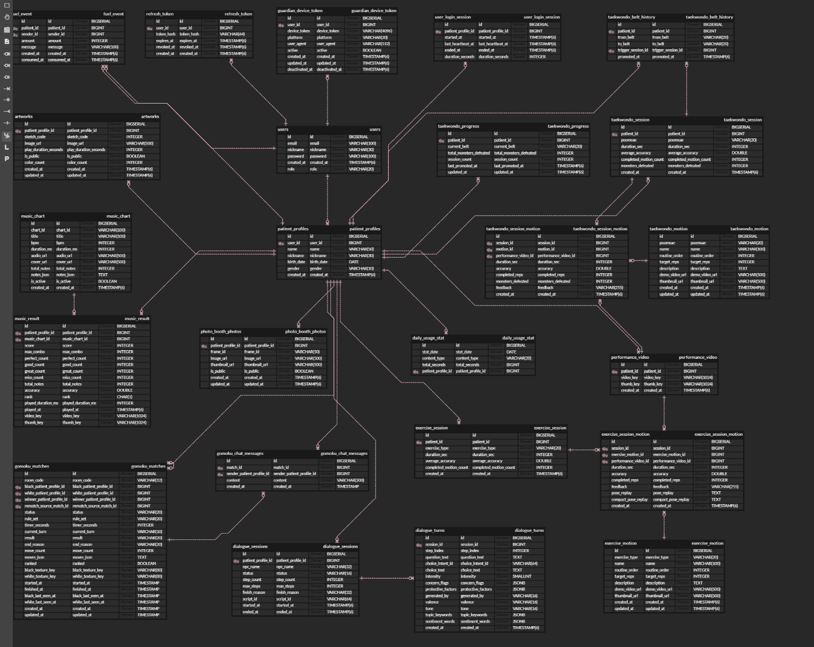
</p>


---

## 📂 프로젝트 구조

<a name="directories"></a>

```bash
S14P31E103/
├── frontend/                         # 프론트엔드 모노레포
│   ├── apps/
│   │   ├── game/                     # 환아용 게임 웹
│   │   │   ├── public/assets/        # 게임 이미지/사운드 리소스
│   │   │   └── src/
│   │   │       ├── scenes/           # Phaser 씬
│   │   │       ├── game/             # 게임 공통 시스템
│   │   │       ├── debug/            # 동작 추적 디버그 페이지
│   │   │       └── auth/             # 데모 인증 처리
│   │   ├── admin/                    # 관리자 웹
│   │       └── src/
│   │           ├── pages/            # 로그인, 회원가입, 모션 관리
│   │           ├── routes/           # 관리자 권한 라우팅
│   │           └── shared/           # 인증 상태, JWT 유틸
│   │   └── guardian-medical/         # 보호자&의료진 웹
│   │       └── src/                  # 환아 프로필, 작품, 운동 기록 확인
│   ├── packages/
│   │   ├── api-client/               # axios API 클라이언트
│   │   ├── domain/                   # 공통 타입
│   │   └── ui/                       # 공통 UI 컴포넌트
│   ├── pnpm-workspace.yaml
│   └── turbo.json
│
├── backend/                          # Spring Boot API 서버
│   ├── src/main/java/com/comong/backend/
│   │   ├── domain/
│   │   │   ├── auth/                 # 인증
│   │   │   ├── user/                 # 사용자
│   │   │   ├── patient/              # 환자 프로필
│   │   │   ├── artwork/              # 작품
│   │   │   └── exercise/             # 체조 동작/세션
│   │   └── global/
│   │       ├── common/response/      # 공통 응답 포맷
│   │       ├── config/               # Security, CORS, Storage, OpenAPI
│   │       ├── exception/            # 예외 처리
│   │       ├── security/             # JWT 인증 필터
│   │       └── storage/              # 로컬 이미지/영상 저장소
│   ├── src/main/resources/db/migration/
│   ├── docs/
│   └── build.gradle
│
├── ai/                               # FastAPI AI 서버
│   ├── app/
│   │   ├── api/v1/                   # health, gymnastics, taekwondo API
│   │   ├── core/                     # 설정, 로깅, 공통 에러
│   │   ├── schemas/                  # Pydantic 요청/응답 스키마
│   │   └── services/
│   │       ├── gymnastics/           # 체조 평가 로직
│   │       └── taekwondo/            # 태권도 분류 로직
│   └── tests/
│
├── infra/                            # 인프라 구성
│   ├── docker-compose-local.yaml     # 로컬 PostgreSQL / Redis
│   ├── docker-compose.dev.yml        # 개발 서버 서비스
│   ├── docker-compose.platform.yml   # Nginx, Jenkins, Prometheus, Grafana
│   ├── nginx/
│   ├── jenkins/
│   └── monitoring/
│
└── .gitlab-ci.yml                    # CI/CD 파이프라인
```
