# WISH 시연 시나리오

## 1. 시연 개요

이 문서는 WISH 서비스의 주요 기능을 시연 순서에 맞춰 정리한 문서입니다.

시연은 세 가지 관점으로 나누어 진행합니다.

1. 게임 사용자 시연
2. 보호자 웹 시연
3. 운영자 콘솔 시연

각 단계는 화면, 실행 동작, 클릭 위치, 설명 멘트 중심으로 작성했습니다.

## 2. 시연 준비

### 2.1 실행 대상

| 구분 | 시연 대상 | 설명 |
| --- | --- | --- |
| 게임 사용자 | WISH 게임 클라이언트 | 아이가 콘텐츠를 체험하는 화면 |
| 보호자 | WISH 보호자 웹 | 아이의 활동, 감정, 리포트, 실시간 화면을 확인하는 화면 |
| 운영자 | WISH Admin | 사용자, 콘텐츠, 모션 데이터를 운영자가 관리하는 화면 |

### 2.2 시연 전 확인 사항

- 게임 클라이언트가 정상 실행되는지 확인합니다.
- 보호자 웹과 운영자 콘솔에 로그인 가능한 계정을 준비합니다.
- 실시간 모니터링 시연을 위해 게임 사용자와 보호자 계정이 서로 연결되어 있어야 합니다.
- 카메라 기반 콘텐츠는 브라우저 또는 앱에서 카메라 권한을 허용해야 합니다.

## 3. 게임 사용자 시연

### 3.1 게임 시작

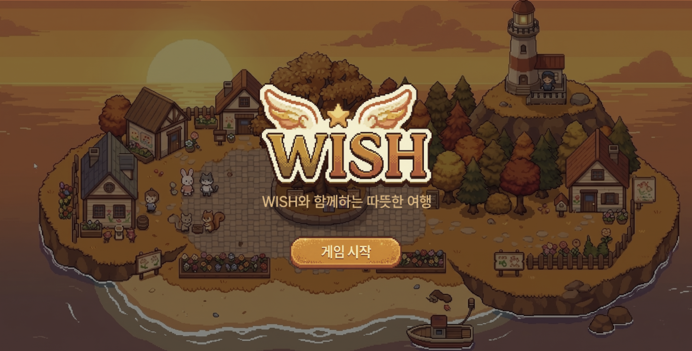

- 실행: 시작 화면에서 `게임 시작` 버튼을 클릭합니다.
- 클릭 위치: 화면 중앙의 `게임 시작` 버튼입니다.
- 설명: 사용자는 WISH 게임에 접속해 첫 화면에서 게임을 시작할 수 있습니다.

### 3.2 로그인

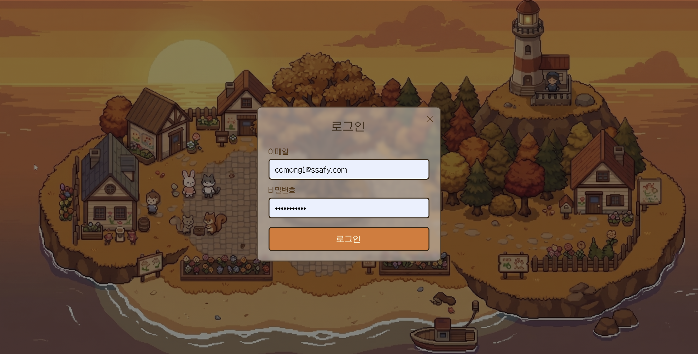

- 실행: 이메일과 비밀번호를 입력한 뒤 `로그인` 버튼을 클릭합니다.
- 클릭 위치: 로그인 모달 하단의 `로그인` 버튼입니다.
- 설명: 로그인 후 사용자의 캐릭터와 활동 기록을 불러옵니다.

### 3.3 조작법 안내 확인

- 실행: 마을에 진입하면 조작법 안내를 확인합니다.
- 클릭 위치: 안내창의 확인 또는 닫기 버튼입니다.
- 설명: 이동, 상호작용, 설정, 이모티콘 단축키를 안내합니다.

### 3.4 설정 변경

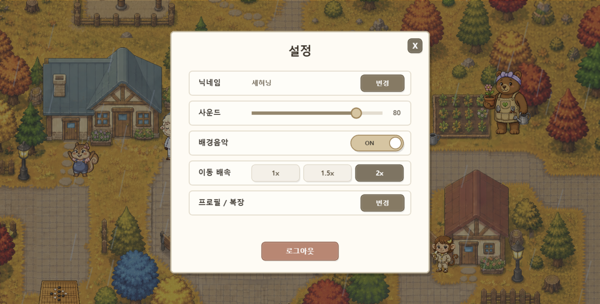

- 실행: `ESC` 또는 설정 버튼으로 설정창을 열고 닉네임, 소리, 이동 속도를 확인합니다.
- 클릭 위치: 설정창 내 BGM, 효과음, 이동 속도 조절 영역입니다.
- 설명: 사용자는 플레이 환경을 직접 조정할 수 있습니다.

### 3.5 복장 변경

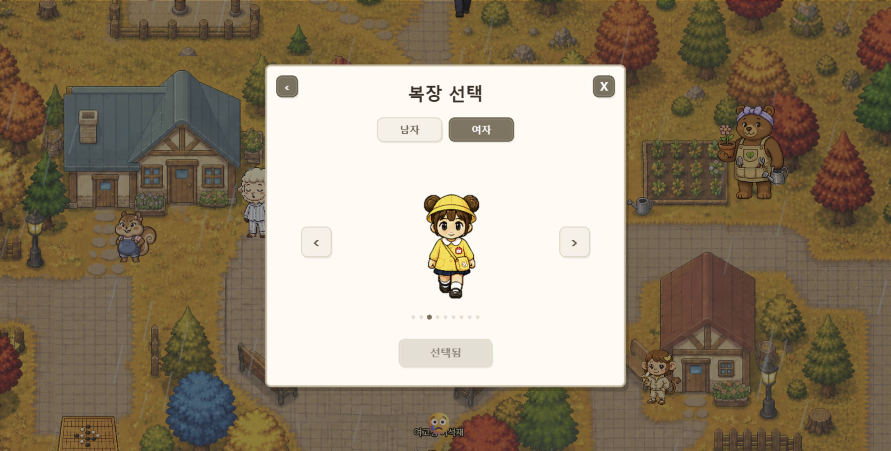

- 실행: 설정창의 복장 변경 메뉴에서 원하는 캐릭터 의상을 선택합니다.
- 클릭 위치: 캐릭터 카드 또는 성별 탭입니다.
- 설명: 사용자는 캐릭터 외형을 바꿔 개인화된 경험을 할 수 있습니다.

### 3.6 마을 이동 및 이모티콘 사용

- 실행: 마을에서 캐릭터를 이동시키고 하단 이모티콘을 선택합니다.
- 클릭 위치: 화면 하단의 이모티콘 버튼입니다.
- 설명: 마을에서는 건물 이동뿐 아니라 간단한 감정 표현도 사용할 수 있습니다.

### 3.7 NPC 대화

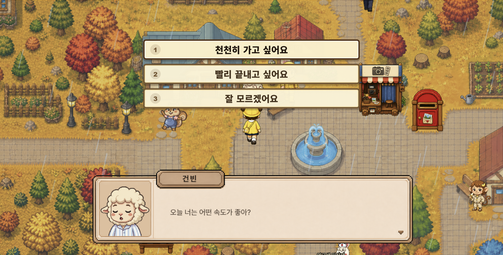

- 실행: NPC에게 다가가 상호작용 키를 누른 뒤 대화 선택지를 고릅니다.
- 클릭 위치: 대화창 하단의 선택지입니다.
- 설명: 사용자는 NPC와 대화하면서 현재 기분이나 선호를 표현할 수 있습니다.

### 3.8 사진관 프레임 선택

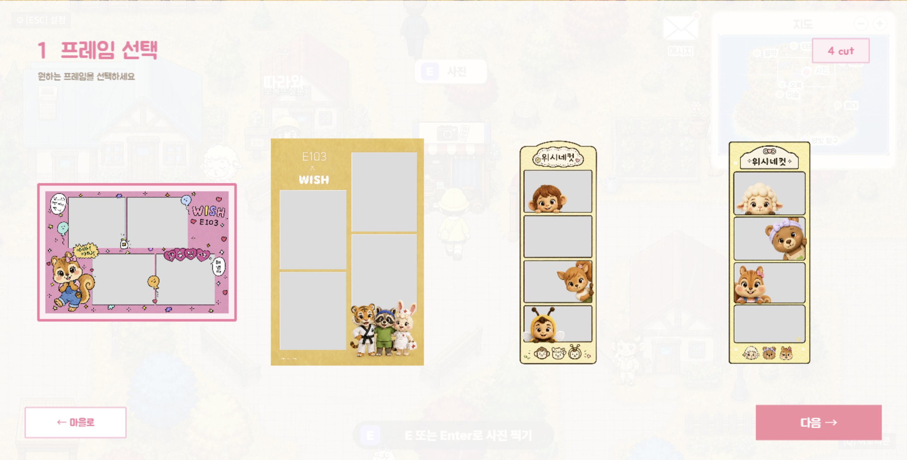

- 실행: 사진관에 입장한 뒤 원하는 사진 프레임을 선택합니다.
- 클릭 위치: 프레임 목록과 `다음` 버튼입니다.
- 설명: 사진관에서는 캐릭터와 함께 기념 이미지를 만들 수 있습니다.

### 3.9 갤러리 확인

- 실행: 갤러리에서 공개된 사진 목록을 확인합니다.
- 클릭 위치: 사진 카드 또는 필터 영역입니다.
- 설명: 사용자는 본인 또는 다른 사용자의 공개 사진을 둘러볼 수 있습니다.

### 3.10 오목 모드 선택

- 실행: 오목 콘텐츠에서 컴퓨터, 로컬, 온라인 모드 중 하나를 선택합니다.
- 클릭 위치: 모드 선택 카드입니다.
- 설명: 오목은 혼자 하거나 다른 사용자와 함께 즐길 수 있는 미니게임입니다.

### 3.11 음악실 입장

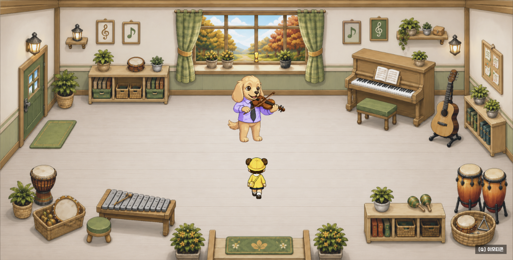

- 실행: 음악실 건물에 들어가 NPC 또는 악기 오브젝트와 상호작용합니다.
- 클릭 위치: 음악실 NPC 또는 콘텐츠 시작 영역입니다.
- 설명: 음악실에서는 리듬 게임 형태의 음악 콘텐츠를 진행합니다.

### 3.12 음악 선택

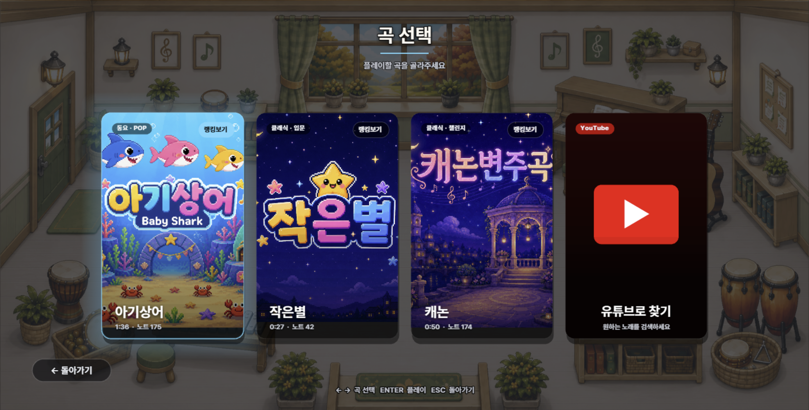

- 실행: 곡 목록에서 플레이할 노래를 선택합니다.
- 클릭 위치: 노래 카드입니다.
- 설명: 기본 곡과 유튜브 검색 기반 곡을 선택할 수 있습니다.

### 3.13 리듬 게임 플레이

- 실행: 화면에 내려오는 노트에 맞춰 입력합니다.
- 클릭 위치: 키보드 입력 또는 지정된 조작 영역입니다.
- 설명: 음악 콘텐츠는 점수, 콤보, 판정 결과를 통해 활동 결과를 제공합니다.

### 3.14 태권도장 입장

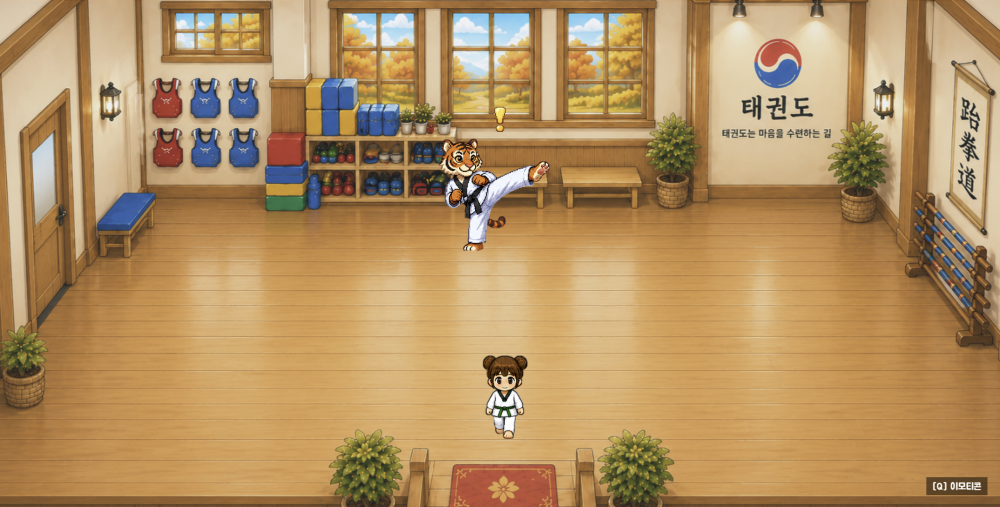

- 실행: 태권도장에 들어가 NPC와 상호작용합니다.
- 클릭 위치: 태권도장 NPC 또는 중앙 콘텐츠 시작 지점입니다.
- 설명: 태권도장은 카메라 기반 자세 인식 콘텐츠를 제공합니다.

### 3.15 태권도 품새 선택

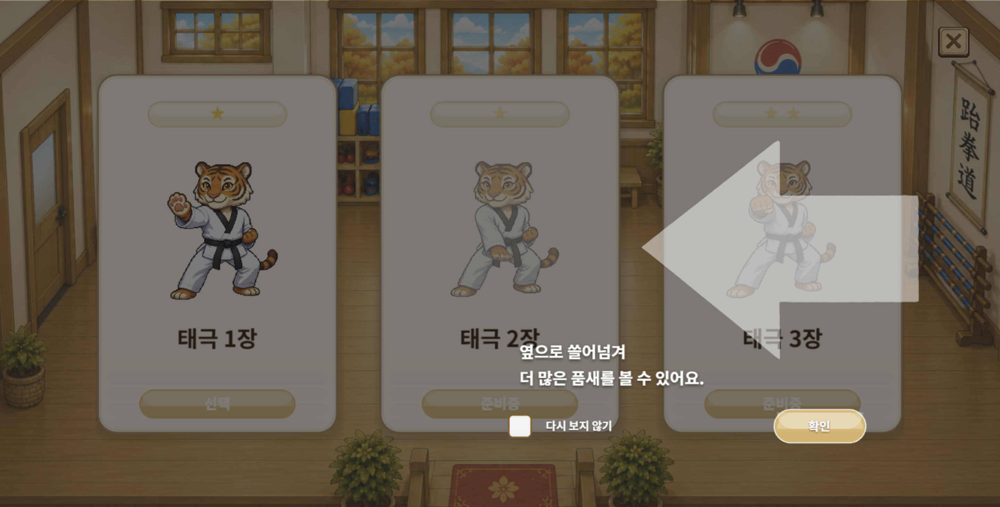

- 실행: 태극 1장, 태극 2장, 태극 3장 중 시연할 품새를 선택합니다.
- 클릭 위치: 품새 카드입니다.
- 설명: 품새별로 서로 다른 동작 순서와 목표가 제공됩니다.

### 3.16 태권도 동작 가이드

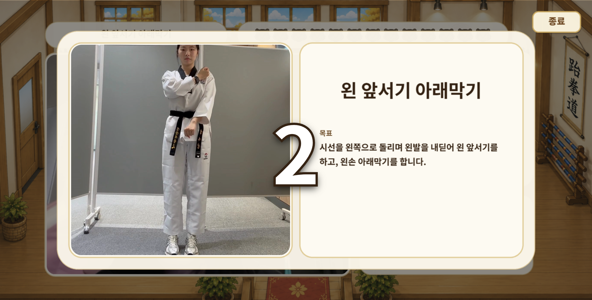

- 실행: 시작 전 동작 설명과 시범 영상을 확인합니다.
- 클릭 위치: 동작 카드 또는 시작 버튼입니다.
- 설명: 사용자는 동작 목표를 먼저 확인한 뒤 따라 할 수 있습니다.

### 3.17 태권도 동작 확인

- 실행: 카메라 앞에서 동작을 수행하고 실시간 피드백을 확인합니다.
- 클릭 위치: 별도 클릭 없이 동작을 수행합니다.
- 설명: 자세 인식 결과에 따라 성공 여부와 피드백이 표시됩니다.

### 3.18 미술실 입장

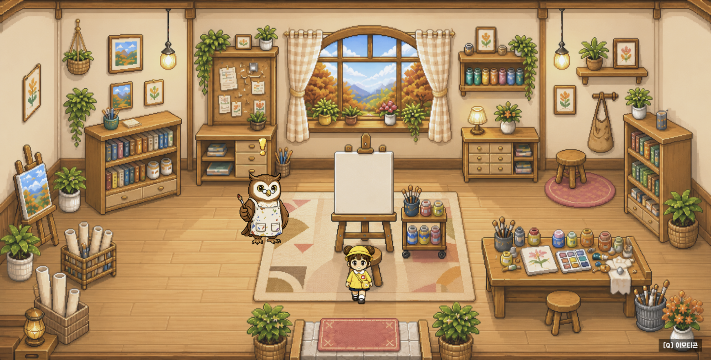

- 실행: 미술실에 들어가 이젤 또는 NPC와 상호작용합니다.
- 클릭 위치: 미술실 중앙의 이젤 또는 NPC입니다.
- 설명: 미술실에서는 그림 퀴즈, 색칠하기, 자유 그림을 진행할 수 있습니다.

### 3.19 그림 퀴즈 모드 선택

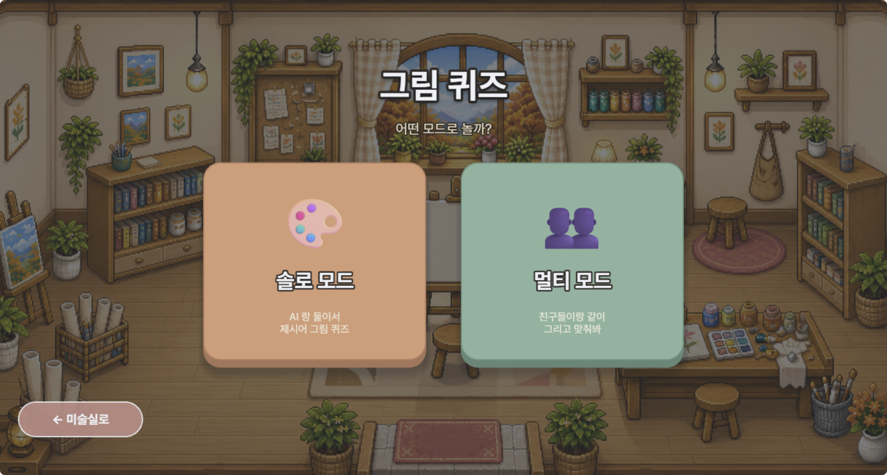

- 실행: 솔로 모드 또는 멀티 모드를 선택합니다.
- 클릭 위치: `솔로 모드`, `멀티 모드` 카드입니다.
- 설명: 혼자 AI와 진행하거나 친구와 함께 그림을 맞히는 방식으로 플레이합니다.

### 3.20 솔로 그림 그리기

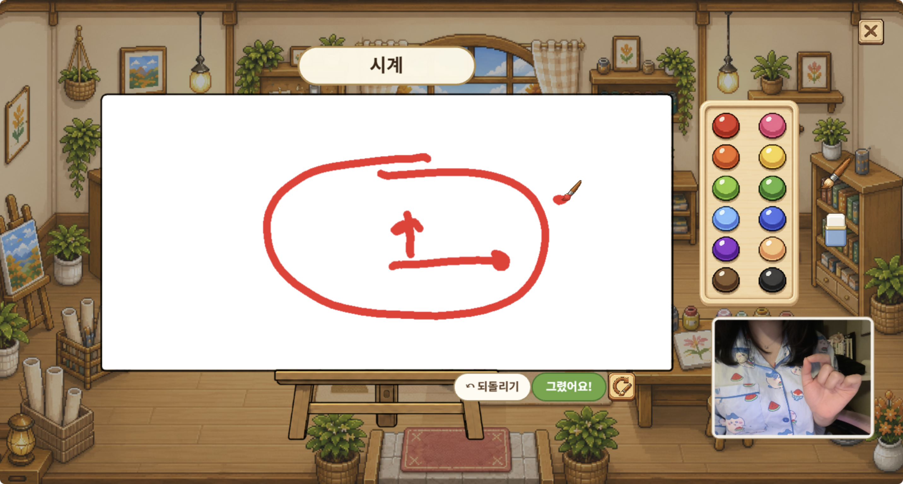

- 실행: 제시어를 보고 색상과 붓을 선택해 그림을 그린 뒤 제출합니다.
- 클릭 위치: 색상 팔레트, 캔버스, `그렸어요!` 버튼입니다.
- 설명: 사용자가 그린 그림을 기반으로 퀴즈 또는 결과 분석을 진행합니다.

### 3.21 멀티 방 목록 확인

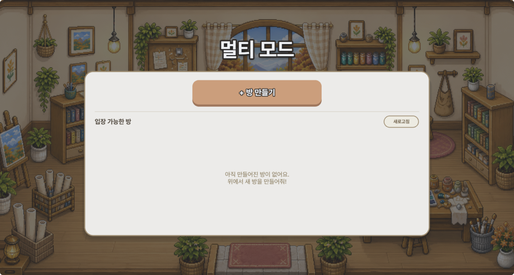

- 실행: 멀티 모드에서 입장 가능한 방을 확인하거나 새 방을 만듭니다.
- 클릭 위치: `방 만들기` 또는 방 목록입니다.
- 설명: 여러 사용자가 같은 방에 들어가 그림 퀴즈를 함께 진행할 수 있습니다.

### 3.22 멀티 대기방

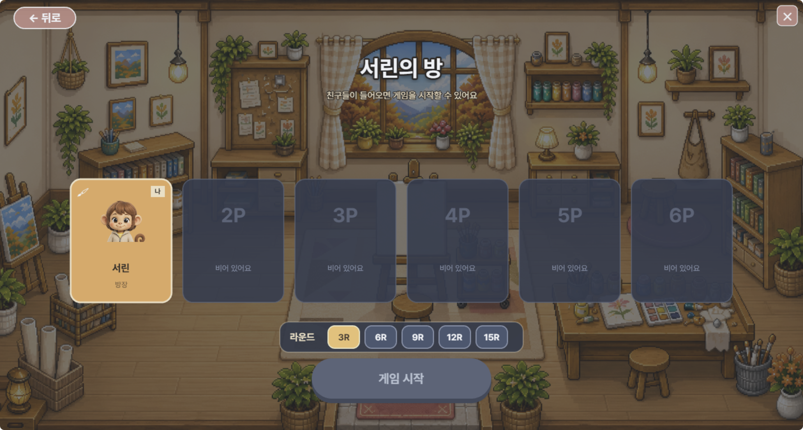

- 실행: 참여 인원과 라운드 수를 확인한 뒤 게임을 시작합니다.
- 클릭 위치: `게임 시작` 버튼입니다.
- 설명: 방장은 라운드 수를 선택하고 참가자 준비 상태를 확인합니다.

### 3.23 색칠할 도안 선택

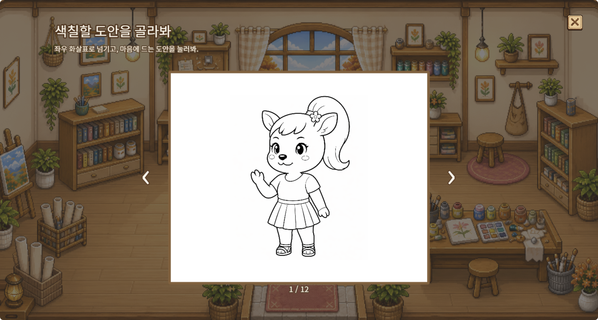

- 실행: 좌우 화살표로 도안을 넘기고 원하는 도안을 선택합니다.
- 클릭 위치: 좌우 화살표 또는 도안 영역입니다.
- 설명: 사용자는 여러 도안 중 하나를 골라 색칠 활동을 시작합니다.

### 3.24 색칠하기

- 실행: 색상 팔레트에서 색을 고르고 도안을 색칠한 뒤 저장합니다.
- 클릭 위치: 색상 팔레트, 도안, `저장하기` 버튼입니다.
- 설명: 색칠 활동 결과는 보호자 웹의 활동 기록에서 확인할 수 있습니다.

### 3.25 체조장 입장

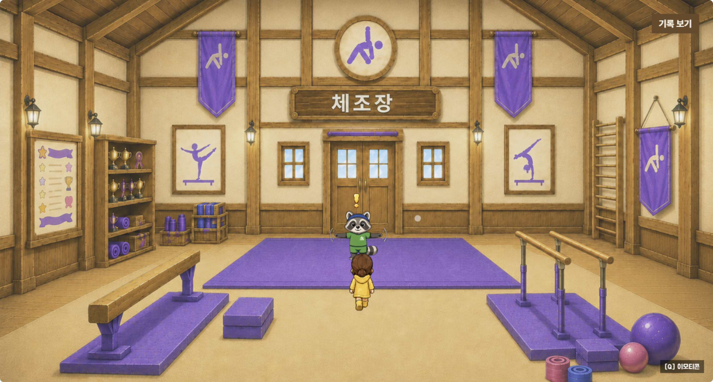

- 실행: 체조장에 들어가 NPC와 상호작용합니다.
- 클릭 위치: 체조장 NPC 또는 콘텐츠 시작 지점입니다.
- 설명: 체조장은 카메라 기반 운동 콘텐츠를 제공합니다.

### 3.26 체조 콘텐츠 선택

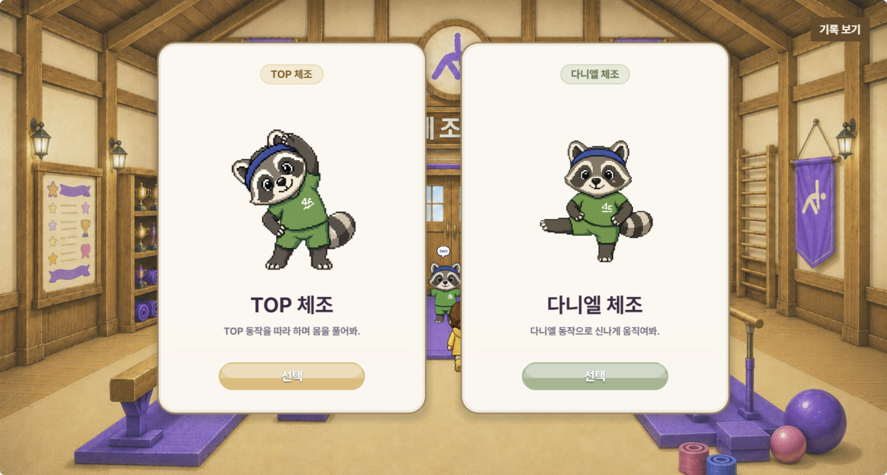

- 실행: TOP 체조 또는 다니엘 체조 중 하나를 선택합니다.
- 클릭 위치: 체조 카드의 `선택` 버튼입니다.
- 설명: 체조 콘텐츠는 여러 동작을 순서대로 따라 하는 방식입니다.

### 3.27 체조 시작

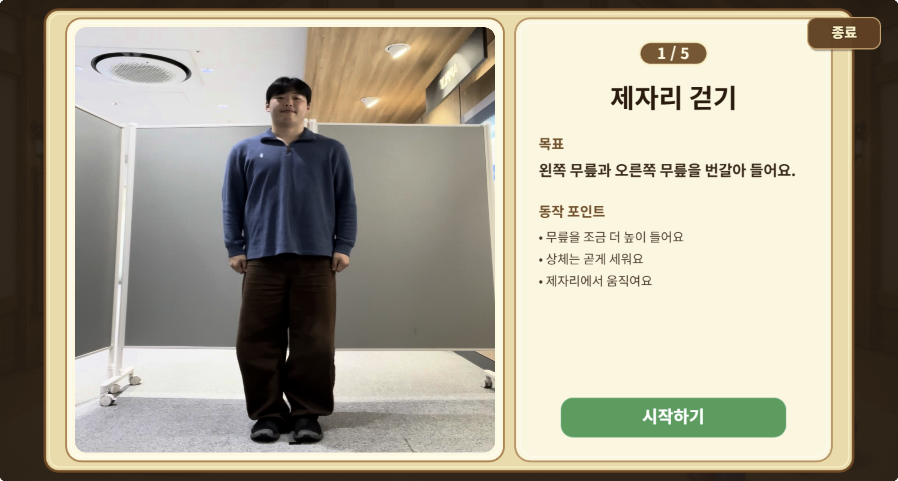

- 실행: 동작 설명을 확인하고 `시작하기` 버튼을 클릭합니다.
- 클릭 위치: 화면 하단의 `시작하기` 버튼입니다.
- 설명: 시작 전 목표 횟수와 동작 포인트를 안내합니다.

### 3.28 체조 실시간 피드백

- 실행: 카메라 앞에서 동작을 수행하고 피드백을 확인합니다.
- 클릭 위치: 별도 클릭 없이 동작을 수행합니다.
- 설명: 화면에는 인식 상태, 시범 영상, 실시간 피드백이 함께 표시됩니다.

### 3.29 등대지기 대화

- 실행: 등대지기 NPC에게 말을 걸고 마이크 안내를 확인합니다.
- 클릭 위치: 마이크 버튼 또는 대화 진행 버튼입니다.
- 설명: 사용자는 음성으로 감정을 표현하고 NPC와 대화를 진행할 수 있습니다.

### 3.30 등대 지역 이동

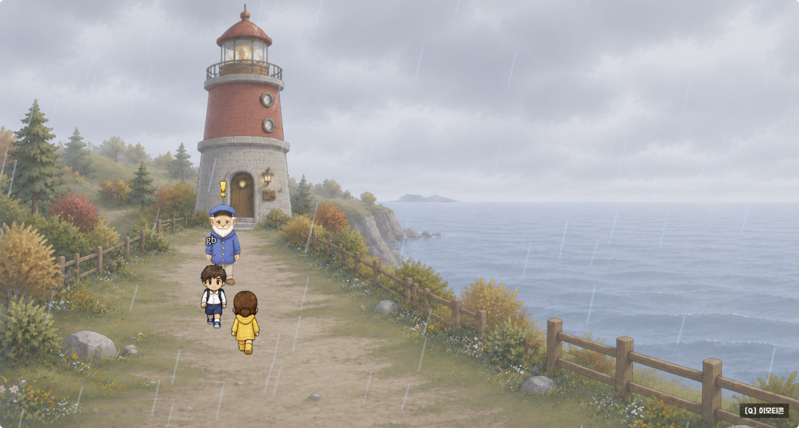

- 실행: 등대 주변 지역으로 이동해 스토리 흐름을 확인합니다.
- 클릭 위치: 이동 키와 상호작용 키입니다.
- 설명: 등대 지역은 별빛 에너지와 보호자 응원 흐름을 연결하는 공간입니다.

### 3.31 별빛 에너지 충전 완료

- 실행: 보호자가 보낸 에너지가 게임에 반영되는지 확인합니다.
- 클릭 위치: 팝업의 `확인` 버튼입니다.
- 설명: 보호자 응원이 아이의 게임 화면에 별빛 에너지로 전달됩니다.

## 4. 보호자 웹 시연

### 4.1 보호자 회원가입

- 실행: 보호자 정보와 아이 정보를 입력해 회원가입합니다.
- 클릭 위치: 입력 폼과 `회원가입` 버튼입니다.
- 설명: 보호자는 가입 시 아이 프로필을 함께 등록할 수 있습니다.

### 4.2 보호자 로그인

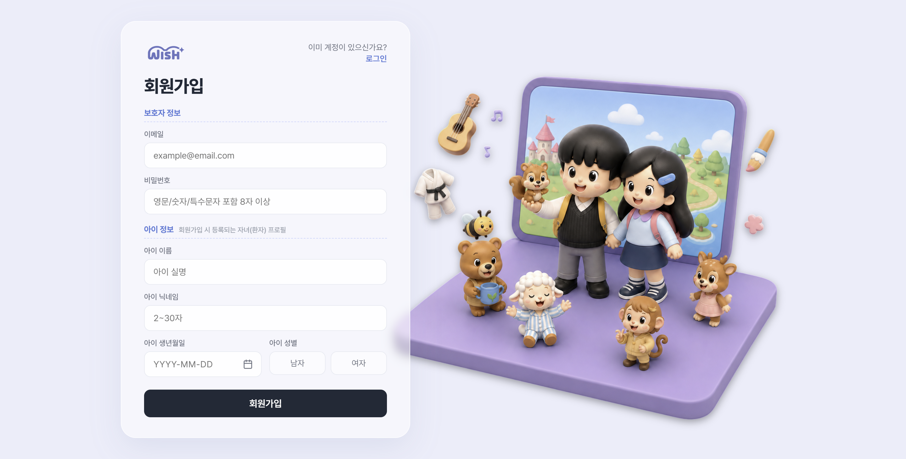

- 실행: 이메일과 비밀번호를 입력해 로그인합니다.
- 클릭 위치: `로그인` 버튼입니다.
- 설명: 로그인 후 아이의 활동 대시보드로 이동합니다.

### 4.3 아이 신체 활동 대시보드

- 실행: 상단 탭에서 `신체`를 선택합니다.
- 클릭 위치: 상단 `신체` 탭입니다.
- 설명: 최근 체조 세션, 동작별 진행률, 오늘의 활동 요약을 확인합니다.

### 4.4 신체 활동 상세 확인

- 실행: 동작 기록에서 특정 관절 또는 동작을 선택합니다.
- 클릭 위치: 왼쪽 동작 목록 또는 상세 보기 영역입니다.
- 설명: 움직임 각도, 좌우 차이, 촬영 안정도, 확인 메모를 볼 수 있습니다.

### 4.5 감정 대화 기록 확인

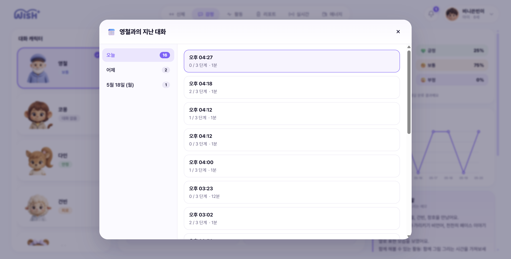

- 실행: 상단 탭에서 `감정`을 선택하고 캐릭터별 대화 기록을 확인합니다.
- 클릭 위치: `감정` 탭과 왼쪽 캐릭터 목록입니다.
- 설명: 아이와 NPC의 대화 내용, 감정 요약, 후속 활동 추천을 확인할 수 있습니다.

### 4.6 음악 활동 결과 확인

- 실행: 상단 탭에서 `활동`을 선택하고 음악 활동을 확인합니다.
- 클릭 위치: 왼쪽 활동 목록의 `음악` 카드입니다.
- 설명: 리듬 정확도, 점수, 플레이 시간, 판정 결과를 확인합니다.

### 4.7 미술 활동 결과 확인

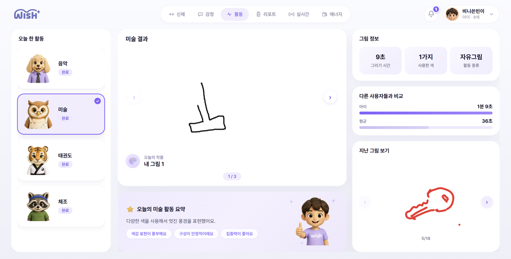

- 실행: 활동 목록에서 `미술`을 선택합니다.
- 클릭 위치: 왼쪽 활동 목록의 `미술` 카드입니다.
- 설명: 아이가 그린 그림, 사용한 색, 그림 시간, 활동 요약을 확인합니다.

### 4.8 태권도 활동 결과 확인

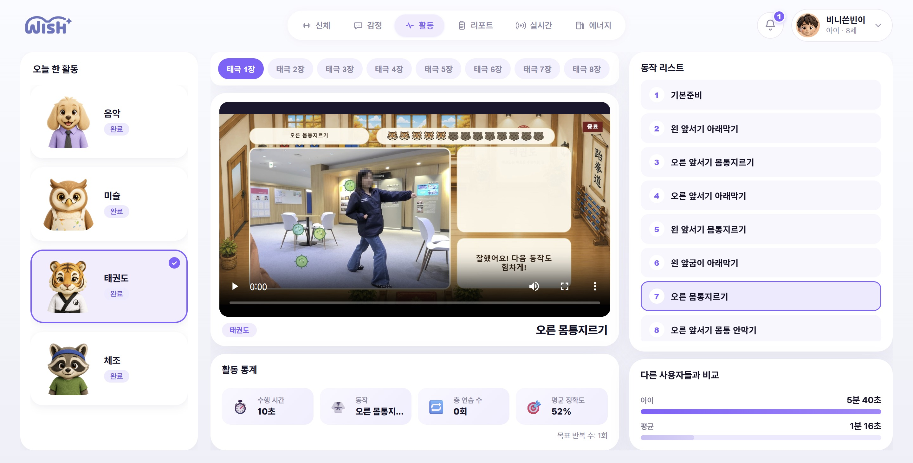

- 실행: 활동 목록에서 `태권도`를 선택합니다.
- 클릭 위치: 왼쪽 활동 목록의 `태권도` 카드입니다.
- 설명: 품새, 동작 리스트, 영상, 참여 시간, 정확도 흐름을 확인합니다.

### 4.9 주간 리포트 확인

- 실행: 상단 탭에서 `리포트`를 선택합니다.
- 클릭 위치: `리포트` 탭입니다.
- 설명: AI 인사이트, 참여 일수, 총 사용 시간, 받은 에너지를 확인합니다.

### 4.10 리포트 상세 지표 확인

- 실행: 리포트 화면을 아래로 스크롤해 상세 지표를 확인합니다.
- 클릭 위치: 스크롤 영역입니다.
- 설명: 참여 캘린더, 친구 대비 사용 시간, 가동 범위 추이, 게임별 성취를 확인합니다.

### 4.11 실시간 모니터링 대기

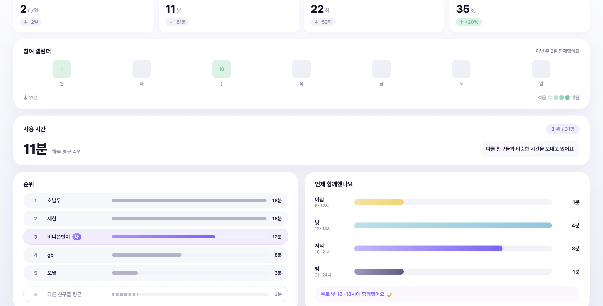

- 실행: 상단 탭에서 `실시간`을 선택하고 `실시간 연결 시작`을 클릭합니다.
- 클릭 위치: `실시간 연결 시작` 버튼입니다.
- 설명: 보호자는 아이가 접속 중일 때 실시간 화면 연결을 요청할 수 있습니다.

### 4.12 실시간 화면 확인

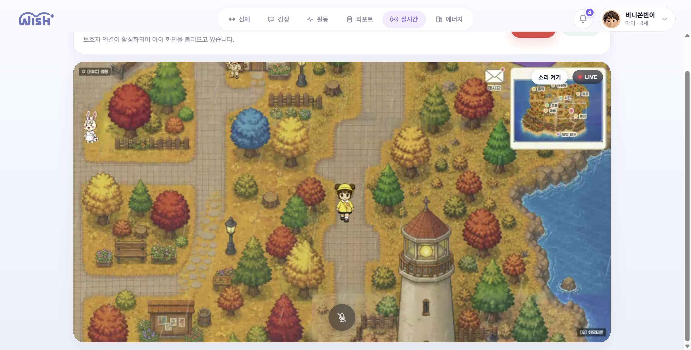

- 실행: 연결이 활성화되면 아이의 게임 화면을 확인합니다.
- 클릭 위치: 실시간 화면 영역, 소리 켜기 버튼, 알림 버튼입니다.
- 설명: 보호자는 아이의 현재 위치와 진행 상황을 실시간으로 볼 수 있습니다.

### 4.13 별빛 에너지 보내기

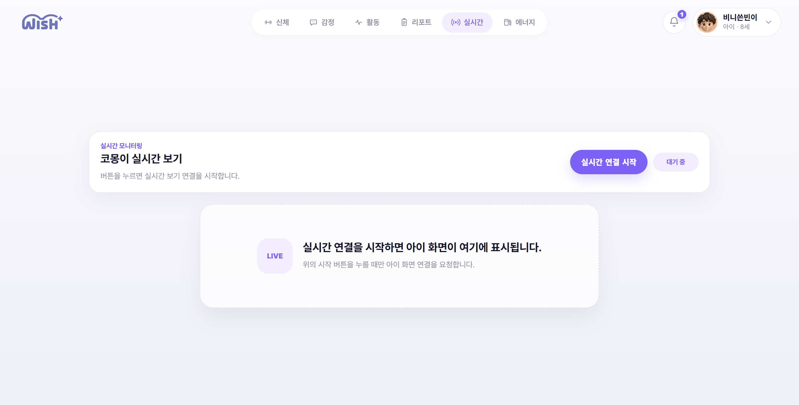

- 실행: 상단 탭에서 `에너지`를 선택하고 에너지 종류와 메시지를 입력합니다.
- 클릭 위치: 에너지 카드, 메시지 입력창, `별빛 에너지 보내기` 버튼입니다.
- 설명: 보호자의 응원 메시지가 아이의 게임 화면에 전달됩니다.

### 4.14 알림 확인

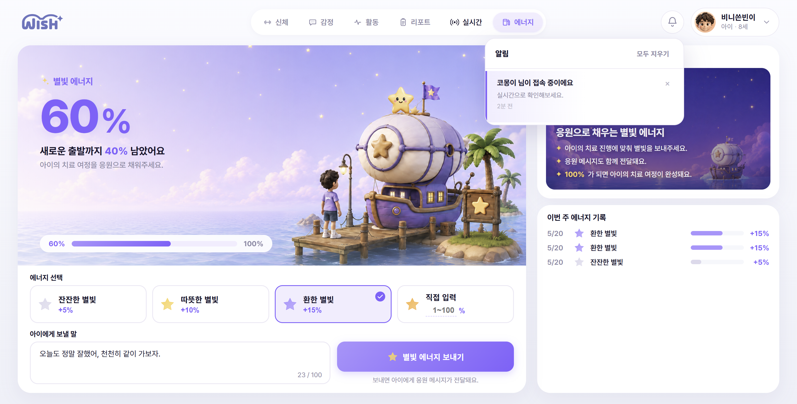

- 실행: 상단 알림 아이콘을 클릭합니다.
- 클릭 위치: 우측 상단 종 모양 알림 아이콘입니다.
- 설명: 아이 접속, 게임 완료, 실시간 연결 상태를 알림으로 확인합니다.

## 5. 운영자 콘솔 시연

### 5.1 운영자 로그인

- 실행: 운영자 이메일과 비밀번호를 입력해 로그인합니다.
- 클릭 위치: `로그인` 버튼입니다.
- 설명: 운영자는 별도 콘솔에서 사용자와 콘텐츠 데이터를 관리합니다.

### 5.2 운영 대시보드 상단 지표 확인

- 실행: 로그인 후 대시보드의 기간 필터를 확인합니다.
- 클릭 위치: `7일`, `14일`, `30일`, `새로고침` 버튼입니다.
- 설명: 총 보호자, 환자 프로필, 활성 환자, 이탈 위험, 앱 사용 시간을 확인합니다.

### 5.3 운영 대시보드 하단 지표 확인

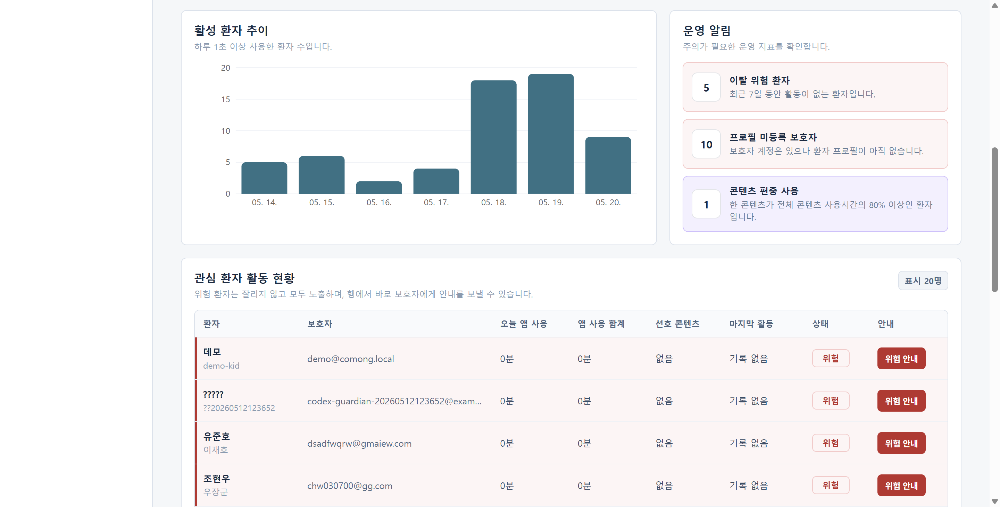

- 실행: 대시보드를 아래로 스크롤해 위험 환자 목록을 확인합니다.
- 클릭 위치: `위험 안내` 버튼입니다.
- 설명: 활동이 적거나 편중된 환자를 빠르게 확인하고 보호자 안내를 진행할 수 있습니다.

### 5.4 유저 관리

- 실행: 왼쪽 메뉴에서 `유저 관리`를 클릭합니다.
- 클릭 위치: 사이드바의 `유저 관리`, 검색창, 권한 선택 박스입니다.
- 설명: 사용자 계정, 환자 프로필 등록 여부, 권한을 확인하고 관리합니다.

### 5.5 환자 활동 상세

- 실행: 대시보드의 환자 목록에서 특정 환자를 선택합니다.
- 클릭 위치: 환자 행 또는 상세 진입 버튼입니다.
- 설명: 환자별 앱 사용 시간, 선호 콘텐츠, 편중 여부, 활동 추이를 확인합니다.

### 5.6 체조 모션 관리

- 실행: 왼쪽 메뉴에서 `모션 관리`를 선택하고 체조 타입을 확인합니다.
- 클릭 위치: 체조 타입 선택 박스, `동작 추가`, `순서 저장`, `수정`, `삭제` 버튼입니다.
- 설명: 운영자는 체조 루틴의 순서, 썸네일, 시범 영상을 관리할 수 있습니다.

### 5.7 태권도 동작 관리

- 실행: 왼쪽 메뉴에서 `태권도 관리`를 선택하고 품새별 동작 목록을 확인합니다.
- 클릭 위치: 품새 선택 박스, `동작 추가`, `수정`, `삭제` 버튼입니다.
- 설명: 품새별 동작 순서, 목표 횟수, 시범 영상을 운영자가 관리합니다.

### 5.8 태권도 동작 추가

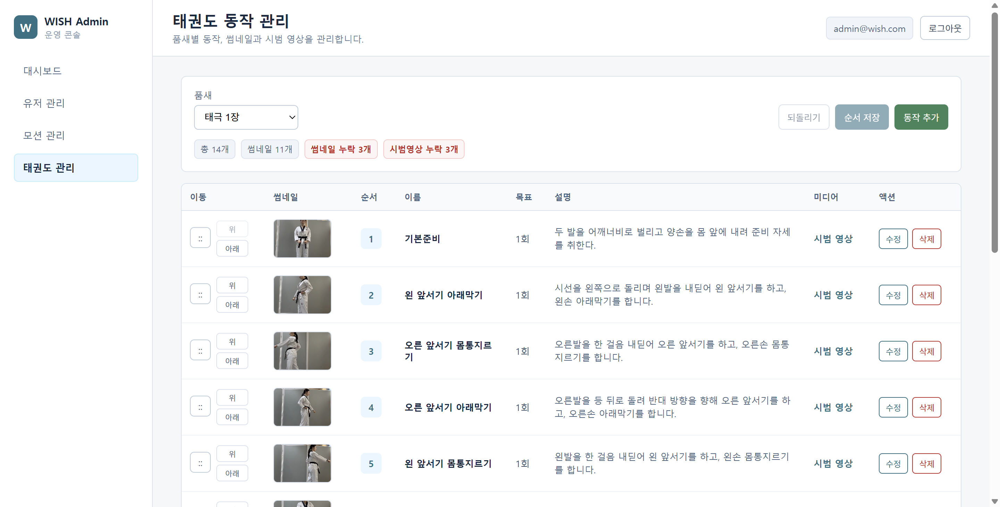

- 실행: `동작 추가` 버튼을 눌러 신규 동작 정보를 입력합니다.
- 클릭 위치: 이름, 설명, 목표 횟수, 썸네일, 시범 영상 입력 영역과 `저장` 버튼입니다.
- 설명: 운영자는 새로운 동작과 미디어를 추가해 콘텐츠를 확장할 수 있습니다.

## 6. 시연 마무리 멘트

WISH는 아이가 게임처럼 콘텐츠를 체험하는 화면, 보호자가 활동과 감정을 확인하는 화면, 운영자가 서비스 데이터를 관리하는 화면으로 구성되어 있습니다.

게임 사용자는 음악, 미술, 체조, 태권도, 대화 콘텐츠를 통해 활동 데이터를 만들고, 보호자는 이 데이터를 바탕으로 아이의 상태를 확인하며 별빛 에너지를 보낼 수 있습니다. 운영자는 전체 사용자와 콘텐츠 데이터를 관리해 서비스 운영 상태를 확인합니다.

