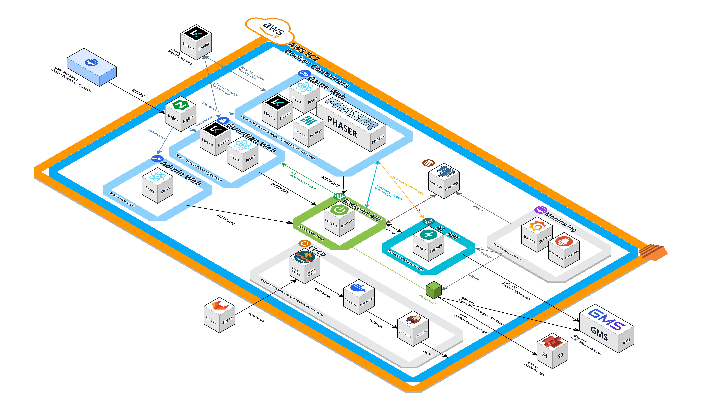

# 포팅 매뉴얼

## 1. 문서 목적

이 문서는 GitLab에서 소스코드를 클론한 뒤 WISH 프로젝트를 빌드하고 배포할 수 있도록 운영 환경, 설정 파일, 환경 변수, 배포 절차를 정리한 문서이다.

소스코드는 별도로 업로드하지 않으며, 실제 운영 비밀번호나 API 키 같은 비밀값은 문서에 포함하지 않는다. 비밀값은 서버의 `.env` 계열 파일 또는 배포 플랫폼의 CI/CD 변수(CI/CD 과정에서 주입되는 환경 변수)에 설정한다.

## 2. 프로젝트 구조

```text
S14P31E103/
├── ai/                         # FastAPI 기반 AI 서비스
├── backend/                    # Spring Boot 기반 API 서버
├── frontend/                   # pnpm workspace 기반 프론트엔드 앱
│   ├── apps/admin              # 관리자 웹
│   ├── apps/game               # 게임 웹
│   └── apps/guardian           # 보호자 웹
├── infra/                      # Docker Compose, Nginx, Jenkins, 모니터링 설정
└── exec/                       # 포팅 매뉴얼 및 외부 서비스 문서
```

## 3. 시스템 아키텍처 다이어그램



## 4. 사용 도구 및 버전

### 4.1 공통 도구

| 구분 | 제품/도구 | 버전 또는 기준 |
| --- | --- | --- |
| 형상 관리 | GitLab | 프로젝트 저장소 기준 |
| 이슈 관리 | Jira | `S14P31E103` 프로젝트 |
| 협업 문서 | Notion | 팀 컨벤션 및 산출물 관리 |
| 컨테이너 | Docker, Docker Compose | Docker Compose v2 기준 |
| CI/CD | GitLab CI, Jenkins | `.gitlab-ci.yml`, `infra/jenkins/Dockerfile` 기준 |
| 운영 OS | Ubuntu | 22.04 LTS 권장 |
| IDE(통합 개발 환경) | IntelliJ IDEA, VS Code | 저장소에서 버전 고정 없음 |

### 4.2 백엔드

| 구분 | 제품/도구 | 버전 또는 기준 |
| --- | --- | --- |
| JVM(Java Virtual Machine, Java 실행 환경) | Eclipse Temurin JRE | 21 |
| Java toolchain | Gradle Java toolchain | 21 |
| WAS(Web Application Server, 웹 애플리케이션 실행 서버) | Spring Boot embedded server | Spring Boot `4.0.5` |
| 빌드 도구 | Gradle Wrapper | Gradle `9.4.1` |
| 주요 프레임워크 | Spring Boot, Spring Security, Spring Data JPA, Flyway | `backend/build.gradle` 기준 |
| DB(Database, 데이터베이스) | PostgreSQL | `15-alpine` |
| Cache(캐시 저장소) | Redis | `7-alpine` |
| API 문서 | springdoc-openapi | `3.0.3` |
| 파일 저장소 | Local 또는 AWS S3 | `STORAGE_TYPE`으로 전환 |

### 4.3 AI 서비스

| 구분 | 제품/도구 | 버전 또는 기준 |
| --- | --- | --- |
| 언어 | Python | Docker 기준 `3.12-slim` |
| WAS(Web Application Server) | FastAPI + Uvicorn | FastAPI `0.115.12`, Uvicorn `0.34.2` |
| 주요 라이브러리 | PyTorch, NumPy, SciPy, sentence-transformers, FAISS | `ai/requirements.txt` 기준 |
| 기본 포트 | Uvicorn | `8001` |

### 4.4 프론트엔드

| 구분 | 제품/도구 | 버전 또는 기준 |
| --- | --- | --- |
| Runtime(실행 환경) | Node.js | `>=20.0.0`, Docker 빌드 이미지 `node:24-alpine` |
| 패키지 매니저 | pnpm | `10.33.0` |
| 모노레포 빌드 | Turborepo | `2.4.4` |
| 주요 프레임워크 | React, Vite, TypeScript | React `19`, Vite `6.2.2`, TypeScript `5.7.3` |
| 3D/게임 | Three.js, Phaser | Three `0.184.0`, Phaser `3.88.2` |
| 정적 웹서버 | Nginx | `1.27-alpine` |

### 4.5 인프라 및 모니터링

| 구분 | 제품/도구 | 버전 또는 기준 |
| --- | --- | --- |
| 웹서버 | Nginx | `1.27-alpine` |
| Reverse proxy(앞단 웹서버가 내부 서버로 요청을 전달하는 방식) | Nginx | `infra/nginx/dev.conf` |
| 모니터링 수집 | Prometheus | `v3.5.0` |
| 모니터링 시각화 | Grafana | `12.1.1` |
| 서버 지표 수집 | node-exporter | `v1.9.1` |
| 컨테이너 지표 수집 | cAdvisor | `v0.52.1` |
| DB 지표 수집 | postgres-exporter | `v0.17.1` |
| Redis 지표 수집 | redis-exporter | `v1.74.0` |

## 5. 주요 설정 파일

### 5.1 백엔드 설정 파일

| 파일 | 용도 |
| --- | --- |
| `backend/src/main/resources/application.yaml` | 공통 Spring Boot 설정 |
| `backend/src/main/resources/application-local.yaml` | 로컬 실행 설정 |
| `backend/src/main/resources/application-dev.yaml` | 개발 서버 배포 설정 |
| `backend/src/main/resources/application-prod.yaml` | 운영 서버 배포 설정 |
| `backend/build.gradle` | 백엔드 의존성, 플러그인, Java 버전 설정 |
| `backend/Dockerfile` | 백엔드 Docker 이미지 빌드 설정 |

### 5.2 AI 설정 파일

| 파일 | 용도 |
| --- | --- |
| `ai/app/core/config.py` | FastAPI 앱 기본 설정 |
| `ai/.env.example` | AI 서비스 환경 변수 예시 |
| `ai/requirements.txt` | Python 의존성 목록 |
| `ai/Dockerfile` | AI Docker 이미지 빌드 설정 |

### 5.3 프론트엔드 설정 파일

| 파일 | 용도 |
| --- | --- |
| `frontend/package.json` | pnpm workspace 공통 스크립트와 의존성 |
| `frontend/pnpm-workspace.yaml` | workspace 패키지 범위 |
| `frontend/turbo.json` | Turborepo 빌드 파이프라인 |
| `frontend/apps/admin/.env.example` | 관리자 웹 환경 변수 예시 |
| `frontend/apps/game/.env.example` | 게임 웹 환경 변수 예시 |
| `frontend/apps/guardian/.env.example` | 보호자 웹 환경 변수 예시 |
| `frontend/Dockerfile` | 프론트엔드 정적 빌드 및 Nginx 서빙 설정 |

### 5.4 배포 및 인프라 설정 파일

| 파일 | 용도 |
| --- | --- |
| `.gitlab-ci.yml` | GitLab CI 검증, 이미지 빌드, Jenkins 배포 호출 |
| `infra/.env.example` | 로컬 Docker Compose 환경 변수 예시 |
| `infra/.env.dev.example` | 개발 서버 Docker Compose 환경 변수 예시 |
| `infra/docker-compose-local.yaml` | 로컬 PostgreSQL/Redis 실행 |
| `infra/docker-compose.dev.yml` | 개발 서버 앱/DB/Redis 실행 |
| `infra/docker-compose.platform.yml` | Nginx, Jenkins, Prometheus, Grafana 실행 |
| `infra/nginx/dev.conf` | dev 도메인 reverse proxy 설정 |
| `infra/jenkins/Dockerfile` | Jenkins + Docker CLI + Docker Compose 플러그인 이미지 |
| `infra/aws-s3-bucket-setup-guide.md` | S3 버킷 구성 가이드 |

## 6. 환경 변수

### 6.1 공통 배포 환경 변수

| 변수명 | 설명 |
| --- | --- |
| `TZ` | 서버 타임존. 기본값은 `Asia/Seoul` |
| `SPRING_PROFILES_ACTIVE` | Spring profile(환경별 설정 묶음). `local`, `dev`, `prod` 중 사용 |
| `APP_ENV` | AI 서비스 실행 환경. 예: `local`, `dev` |

### 6.2 DB 및 Redis

| 변수명 | 설명 |
| --- | --- |
| `POSTGRES_DEV_DB` | 개발 서버 PostgreSQL DB 이름 |
| `POSTGRES_DEV_USER` | 개발 서버 PostgreSQL 사용자 |
| `POSTGRES_DEV_PASSWORD` | 개발 서버 PostgreSQL 비밀번호 |
| `DB_URL` | Spring Boot datasource URL |
| `DB_USERNAME` | Spring Boot DB 접속 사용자 |
| `DB_PASSWORD` | Spring Boot DB 접속 비밀번호 |
| `JPA_DDL_AUTO` | JPA DDL(스키마 자동 처리) 전략. 배포 환경은 `validate` 권장 |
| `REDIS_HOST` | Redis host |
| `REDIS_PORT` | Redis port |

### 6.3 인증 및 보안

| 변수명 | 설명 |
| --- | --- |
| `JWT_SECRET` | JWT(JSON Web Token, 인증 토큰) 서명 키 |
| `JWT_ACCESS_TTL_SECONDS` | Access token(짧게 쓰는 인증 토큰) 만료 시간 |
| `JWT_REFRESH_TTL_SECONDS` | Refresh token(재발급용 인증 토큰) 만료 시간 |
| `JWT_ISSUER` | JWT 발급자 |

### 6.4 파일 저장소

| 변수명 | 설명 |
| --- | --- |
| `STORAGE_TYPE` | 파일 저장소 방식. `local` 또는 `s3` |
| `STORAGE_UPLOAD_DIR` | 로컬 저장소 업로드 디렉터리 |
| `STORAGE_PUBLIC_URL_PREFIX` | 로컬 저장소 public URL prefix(공개 접근 경로 접두사) |
| `AWS_REGION` | AWS 리전 |
| `AWS_S3_PRIVATE_BUCKET` | S3 private bucket 이름 |
| `AWS_S3_PRIVATE_PREFIX` | S3 객체 prefix(버킷 내부 경로 접두사) |
| `AWS_S3_PRESIGNED_TTL_SECONDS` | Presigned URL(임시 접근 URL) 유효 시간 |

### 6.5 외부 API 연동

| 변수명 | 설명 |
| --- | --- |
| `LIVEKIT_URL` | LiveKit WebSocket URL |
| `LIVEKIT_API_KEY` | LiveKit API key |
| `LIVEKIT_API_SECRET` | LiveKit API secret |
| `FIREBASE_PUSH_ENABLED` | Firebase push 활성화 여부 |
| `FIREBASE_PROJECT_ID` | Firebase 프로젝트 ID |
| `FIREBASE_CREDENTIALS_BASE64` | Firebase service account JSON을 base64로 인코딩한 값 |
| `YOUTUBE_API_KEY` | YouTube Data API key |
| `YOUTUBE_BASE_URL` | YouTube Data API base URL |
| `YOUTUBE_TIMEOUT_SECONDS` | YouTube API timeout(응답 제한 시간) |
| `GMS_KEY` | GMS API key |
| `GMS_ANTHROPIC_BASE_URL` | GMS Anthropic API base URL |
| `GMS_ANTHROPIC_MODEL` | GMS Anthropic model |
| `GMS_ANTHROPIC_VERSION` | Anthropic API version |
| `GMS_OPENAI_BASE_URL` | GMS OpenAI 호환 API base URL |
| `WHISPER_MODEL` | STT(Speech To Text, 음성 텍스트 변환) 모델 |
| `WHISPER_LANGUAGE` | Whisper 인식 언어 |

### 6.6 프론트엔드 빌드 환경 변수

| 변수명 | 설명 |
| --- | --- |
| `VITE_APP_BASE_PATH` | 앱이 서비스되는 base path(기준 경로) |
| `VITE_API_BASE_URL` | Spring Boot API base URL |
| `VITE_AI_BASE_URL` | FastAPI AI API base URL |
| `VITE_API_PROXY_TARGET` | 로컬 Vite proxy(개발 서버 요청 전달) 대상 |
| `VITE_AI_PROXY_TARGET` | 로컬 AI proxy 대상 |
| `VITE_AI_PROXY_PREFIX` | 로컬 AI proxy prefix |
| `VITE_ENABLE_DEMO_AUTH` | 데모 인증 활성화 여부 |

## 7. 로컬 실행

### 7.1 사전 준비

```bash
git clone <GitLab repository URL>
cd S14P31E103
```

필수 도구는 아래와 같다.

- Java 21
- Docker 및 Docker Compose
- Node.js 20 이상
- pnpm 10.33.0 권장
- Python 3.12 권장

### 7.2 로컬 인프라 실행

```bash
cd infra
cp .env.example .env
docker compose -f docker-compose-local.yaml up -d
```

실행되는 서비스:

| 서비스 | 컨테이너명 | 포트 |
| --- | --- | --- |
| PostgreSQL | `e103-postgres-local` | `5432` |
| Redis | `e103-redis-local` | `6379` |

### 7.3 백엔드 실행

```bash
cd backend
./gradlew bootRun
```

Windows PowerShell에서는 아래 명령을 사용한다.

```powershell
cd backend
.\gradlew.bat bootRun
```

기본 API 경로:

```text
http://localhost:8080/api/v1
```

Health check(서버 상태 확인 요청):

```text
http://localhost:8080/api/v1/actuator/health
```

### 7.4 AI 서비스 실행

```bash
cd ai
cp .env.example .env
pip install -r requirements.txt
uvicorn app.main:app --host 0.0.0.0 --port 8001
```

Health check:

```text
http://localhost:8001/api/v1/health
```

### 7.5 프론트엔드 실행

```bash
cd frontend
corepack enable
pnpm install --frozen-lockfile
pnpm dev
```

개별 앱만 실행할 경우:

```bash
pnpm --filter @wish/admin dev
pnpm --filter @wish/game dev
pnpm --filter @wish/guardian dev
```

## 8. 빌드 명령어

### 8.1 백엔드 빌드

```bash
cd backend
./gradlew clean build
```

테스트를 제외하고 JAR만 만들 경우:

```bash
cd backend
./gradlew bootJar -x test
```

### 8.2 AI 이미지 빌드

```bash
cd ai
docker build -t e103-wish-ai:local .
```

### 8.3 프론트엔드 빌드

```bash
cd frontend
pnpm install --frozen-lockfile
pnpm build
```

개별 앱 Docker 이미지 빌드 예시:

```bash
cd frontend
docker build \
  --build-arg APP_NAME=game \
  --build-arg VITE_APP_BASE_PATH=/ \
  --build-arg VITE_API_BASE_URL=https://api-dev.wish-e103.xyz/api/v1 \
  --build-arg VITE_AI_BASE_URL=https://ai-dev.wish-e103.xyz/api/v1 \
  -t e103-wish-frontend-game:local .
```

## 9. 개발 서버 배포

### 9.1 서버 디렉터리 기준

운영 서버에서는 아래와 같은 경로를 기준으로 둔다.

```text
/home/ubuntu/S14P31E103
```

### 9.2 플랫폼 서비스 실행

Nginx, Jenkins, Prometheus, Grafana는 platform compose 파일로 실행한다.

```bash
cd /home/ubuntu/S14P31E103/infra
cp .env.dev.example .env.dev
docker compose -f docker-compose.platform.yml up -d
```

### 9.3 애플리케이션 서비스 실행

백엔드, AI, 프론트엔드, PostgreSQL, Redis는 dev compose 파일로 실행한다.

```bash
cd /home/ubuntu/S14P31E103/infra
docker compose --env-file .env.dev -f docker-compose.dev.yml up -d
```

서비스 구성:

| 서비스 | 컨테이너명 | 내부 포트 |
| --- | --- | --- |
| Backend | `e103-backend-dev` | `8080` |
| AI | `e103-ai-dev` | `8001` |
| Game Frontend | `e103-frontend-game-dev` | `80` |
| Admin Frontend | `e103-frontend-admin-dev` | `80` |
| Guardian Frontend | `e103-frontend-guardian-dev` | `80` |
| PostgreSQL | `e103-postgres-dev` | `5432` |
| Redis | `e103-redis-dev` | `6379` |

### 9.4 Nginx 라우팅

Nginx는 reverse proxy로 외부 도메인 요청을 내부 컨테이너로 전달한다.

| 외부 도메인 또는 경로 | 내부 서비스 |
| --- | --- |
| `https://game-dev.wish-e103.xyz` | `frontend-game-dev:80` |
| `https://admin-dev.wish-e103.xyz` | `frontend-admin-dev:80` |
| `https://guardian-dev.wish-e103.xyz` | `frontend-guardian-dev:80` |
| `https://api-dev.wish-e103.xyz/api/v1/` | `backend-dev:8080/api/v1/` |
| `https://ai-dev.wish-e103.xyz/api/v1/` | `ai-dev:8001/api/v1/` |
| `https://jenkins.wish-e103.xyz` | `jenkins:8080` |
| `https://k14e103.p.ssafy.io/dev/game/` | `frontend-game-dev:80` |
| `https://k14e103.p.ssafy.io/dev/admin/` | `frontend-admin-dev:80` |
| `https://k14e103.p.ssafy.io/dev/api/v1/` | `backend-dev:8080/api/v1/` |

`upstream`은 Nginx가 요청을 넘기는 내부 서비스 주소를 의미한다.

### 9.5 GitLab CI/CD 흐름

`.gitlab-ci.yml` 기준 파이프라인 단계는 아래와 같다.

```text
verify -> build -> package -> deploy -> notify
```

주요 흐름:

1. `verify`: format, lint, test 등 검증 수행
2. `build`: 프론트엔드 빌드 또는 AI base image 빌드
3. `package`: Docker image(컨테이너 실행 이미지) 생성 및 Docker Hub push
4. `deploy`: Jenkins job을 호출해 서버에서 최신 이미지를 배포
5. `notify`: 실패 시 Mattermost 등으로 알림

Docker Hub에 push되는 이미지 태그는 GitLab CI 변수와 branch slug(브랜치명을 URL/태그에 쓰기 좋게 바꾼 값)를 기준으로 생성된다.

## 10. 배포 시 특이사항

1. 실제 비밀값은 Git에 커밋하지 않는다.
2. `infra/.env.dev`는 서버에서만 관리한다.
3. `JPA_DDL_AUTO`는 배포 환경에서 `validate`를 권장한다.
4. DB 스키마 변경은 Flyway migration(버전별 SQL 마이그레이션) 파일로 관리한다.
5. 파일 저장소를 S3로 사용할 경우 `STORAGE_TYPE=s3`와 AWS 관련 변수를 함께 설정한다.
6. Nginx SSL 인증서는 `/etc/letsencrypt` 경로를 컨테이너에 read-only로 마운트한다.
7. Jenkins 컨테이너는 `/var/run/docker.sock`을 마운트해 호스트 Docker를 제어한다.
8. 프론트엔드 빌드 시 `VITE_*` 환경 변수는 런타임이 아니라 빌드 타임(빌드하는 순간)에 반영된다.
9. SSE(Server-Sent Events, 서버가 브라우저로 단방향 이벤트를 계속 보내는 방식)와 WebSocket(양방향 실시간 통신)은 Nginx timeout 설정 영향을 받는다.
10. AI 서비스는 PyTorch 등 대용량 의존성이 있어 이미지 빌드 시간이 길 수 있다.

## 11. DB 접속 정보 및 주요 프로퍼티 파일 목록

### 11.1 DB 접속 정보

| 환경 | DB | Host | Port | Database | User |
| --- | --- | --- | --- | --- | --- |
| local | PostgreSQL | `localhost` 또는 `db-local` | `5432` | `e103_db` | `postgres` |
| dev | PostgreSQL | `postgres-dev` | `5432` | `${POSTGRES_DEV_DB}` | `${POSTGRES_DEV_USER}` |

비밀번호는 아래 파일 또는 서버 환경 변수에서 관리한다.

- local: `infra/.env`
- dev: `infra/.env.dev`
- Spring Boot: `DB_PASSWORD`

### 11.2 DB 관련 프로퍼티 파일

| 파일 | 주요 항목 |
| --- | --- |
| `backend/src/main/resources/application.yaml` | `spring.profiles.active`, `security.jwt`, `storage`, `youtube`, `gms`, `ai` |
| `backend/src/main/resources/application-local.yaml` | local datasource, JPA, Flyway 설정 |
| `backend/src/main/resources/application-dev.yaml` | dev datasource, JPA, storage, AI service URL |
| `backend/src/main/resources/application-prod.yaml` | prod datasource, JPA, storage |
| `backend/src/main/resources/db/migration/*.sql` | Flyway DB migration SQL |
| `infra/.env.example` | local DB/Redis/JWT/S3/GMS 예시 변수 |
| `infra/.env.dev.example` | dev DB/Redis/JWT/S3/GMS 예시 변수 |

## 12. 배포 후 확인 항목

### 12.1 컨테이너 상태

```bash
cd /home/ubuntu/S14P31E103/infra
docker compose -f docker-compose.platform.yml ps
docker compose --env-file .env.dev -f docker-compose.dev.yml ps
```

### 12.2 API 상태 확인

```bash
curl -f https://api-dev.wish-e103.xyz/api/v1/actuator/health
curl -f https://ai-dev.wish-e103.xyz/api/v1/health
```

### 12.3 로그 확인

```bash
cd /home/ubuntu/S14P31E103/infra
docker compose --env-file .env.dev -f docker-compose.dev.yml logs -f backend-dev
docker compose --env-file .env.dev -f docker-compose.dev.yml logs -f ai-dev
docker compose -f docker-compose.platform.yml logs -f nginx
```

### 12.4 웹 접속 확인

아래 URL에 접속해 화면이 정상 렌더링되는지 확인한다.

- `https://game-dev.wish-e103.xyz`
- `https://admin-dev.wish-e103.xyz`
- `https://guardian-dev.wish-e103.xyz`
- `https://k14e103.p.ssafy.io/dev/game/`
- `https://k14e103.p.ssafy.io/dev/admin/`

## 13. 장애 대응 참고

| 증상 | 확인할 항목 |
| --- | --- |
| 백엔드가 DB에 접속하지 못함 | `DB_URL`, `DB_USERNAME`, `DB_PASSWORD`, `postgres-dev` health check |
| 로그인 또는 인증 실패 | `JWT_SECRET`, token TTL, 서버 시간 |
| 프론트에서 API 호출 실패 | `VITE_API_BASE_URL`, Nginx proxy, CORS(Cross-Origin Resource Sharing, 다른 출처 요청 허용 정책) |
| AI 평가 API 실패 | `VITE_AI_BASE_URL`, `AI_DIALOGUE_BASE_URL`, `AI_REPORT_BASE_URL`, `ai-dev` 로그 |
| 이미지/영상 업로드 실패 | `STORAGE_TYPE`, S3 bucket, AWS region, presigned URL 설정 |
| 실시간 기능 실패 | LiveKit 변수, WebSocket proxy header, Nginx timeout |
| 푸시 알림 실패 | `FIREBASE_PUSH_ENABLED`, `FIREBASE_PROJECT_ID`, `FIREBASE_CREDENTIALS_BASE64` |
